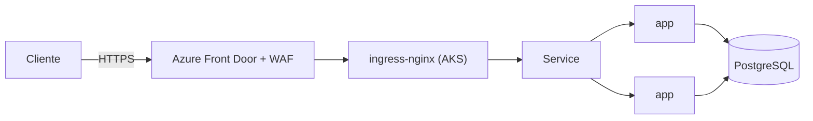

# Users API

Servicio REST de gestión de usuarios (`dni`, `name`) sobre `/api/users`. Node + Express
con persistencia en PostgreSQL. Este repositorio contiene la aplicación, su empaquetado en
contenedor, los manifiestos de Kubernetes y la infraestructura como código que la corre en
Azure, además de los pipelines de CI/CD.

La documentación técnica completa (arquitectura cloud, diseño de cada componente, operación
y runbooks) vive en la **wiki del equipo** (Azure DevOps). Este README es el punto de entrada
para trabajar con el repositorio.

## Arquitectura (resumen)

El tráfico público entra por **Azure Front Door** (con WAF), que reenvía al **ingress-nginx**
de un clúster **AKS**. La aplicación corre con varias réplicas detrás de un Service interno y
persiste en **PostgreSQL**. Los secretos se resuelven desde **Azure Key Vault** (Secrets Store
CSI), los certificados TLS los emite **Let's Encrypt** vía cert-manager (DNS-01 sobre Azure DNS),
y las políticas de seguridad de la plataforma las aplica **Kyverno**.



## Estructura del repositorio

```
app/                  Aplicación Node/Express
  index.js            Arranque del server, healthchecks, shutdown ordenado
  users/              Controller, modelo (Sequelize) y router del recurso usuarios
  shared/             Conexión a la DB (sqlite/postgres) y middleware de validación
  health/             Endpoints /health (liveness) y /ready (readiness)
Dockerfile            Imagen multi-stage, non-root, con healthcheck
docker-compose.yml    Stack local (app + postgres)
k8s/
  base/               Manifiestos comunes (Deployment, Service, HPA, Ingress, PDB,
                      NetworkPolicy, ConfigMap, ServiceAccount) en Kustomize
  overlays/
    local-kind/       Entorno local (kind): postgres in-cluster + issuer self-signed
    aks-live/         AKS sin dominio aún: imagen de ACR + self-signed
    aks/              AKS productivo: Let's Encrypt (DNS-01) + secretos vía Key Vault
    sticky-demo/      Variante con afinidad de sesión por cookie
  policies/           Políticas Kyverno (límites, securityContext, NetworkPolicy)
terraform/            Infraestructura en Azure (AKS, ACR, Key Vault, DNS, Front Door)
scripts/              bootstrap-addons.sh (instalación de add-ons del clúster)
.github/workflows/    ci.yml (build/test/scan/push) y cd.yml (deploy a AKS)
```

## Correr localmente

Sin contenedores (usa sqlite en memoria por defecto):

```bash
cd app
npm ci
npm start            # http://localhost:8000/api/users
npm test             # unit tests
npm run test:coverage
npm run lint
```

Stack completo con PostgreSQL:

```bash
docker compose up -d --build
curl localhost:8000/api/users
```

En Kubernetes local (kind):

```bash
make kind-deploy     # build + load + kubectl apply -k k8s/overlays/local-kind
```

## Build y despliegue

- **CI** (`.github/workflows/ci.yml`): instala dependencias, linter, tests con cobertura,
  análisis estático (SonarQube Cloud), construye la imagen, la escanea con Trivy y la publica
  en GHCR. Corre en cada push y PR.
- **CD** (`.github/workflows/cd.yml`): se autentica a Azure por OIDC, importa la imagen a ACR,
  toma credenciales de AKS y aplica el overlay correspondiente. Se dispara por tag de release
  o manualmente.

La infraestructura se aplica con Terraform (`terraform/`); ver `terraform/README.md`. Los
add-ons del clúster (ingress-nginx, cert-manager, metrics-server, Kyverno) se instalan con
`scripts/bootstrap-addons.sh`.

## Endpoints

| Método | Ruta | Descripción |
|---|---|---|
| GET | `/api/users` | Lista usuarios |
| GET | `/api/users/:id` | Obtiene un usuario |
| POST | `/api/users` | Crea un usuario (`{ "dni", "name" }`) |
| GET | `/health` | Liveness |
| GET | `/ready` | Readiness (verifica la DB) |

## Configuración

La aplicación se configura por variables de entorno (ver `app/.env.example`): `PORT`,
`DB_DIALECT` (`sqlite`/`postgres`) y, para postgres, `DB_HOST`/`DB_PORT`/`DB_NAME`/`DB_USER`/
`DB_PASSWORD`. En el clúster, los valores no sensibles vienen de un ConfigMap y el password de
la base desde Key Vault.
