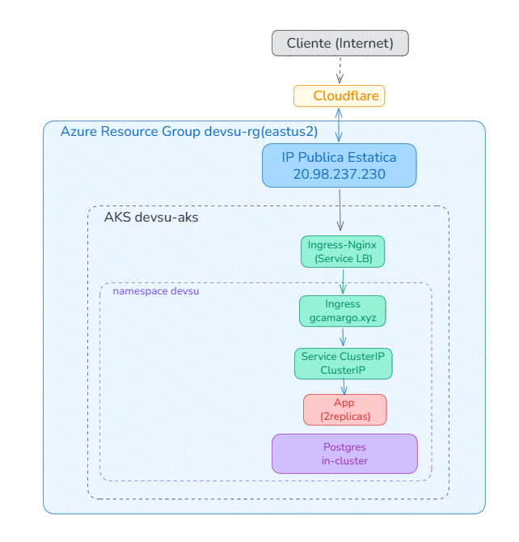
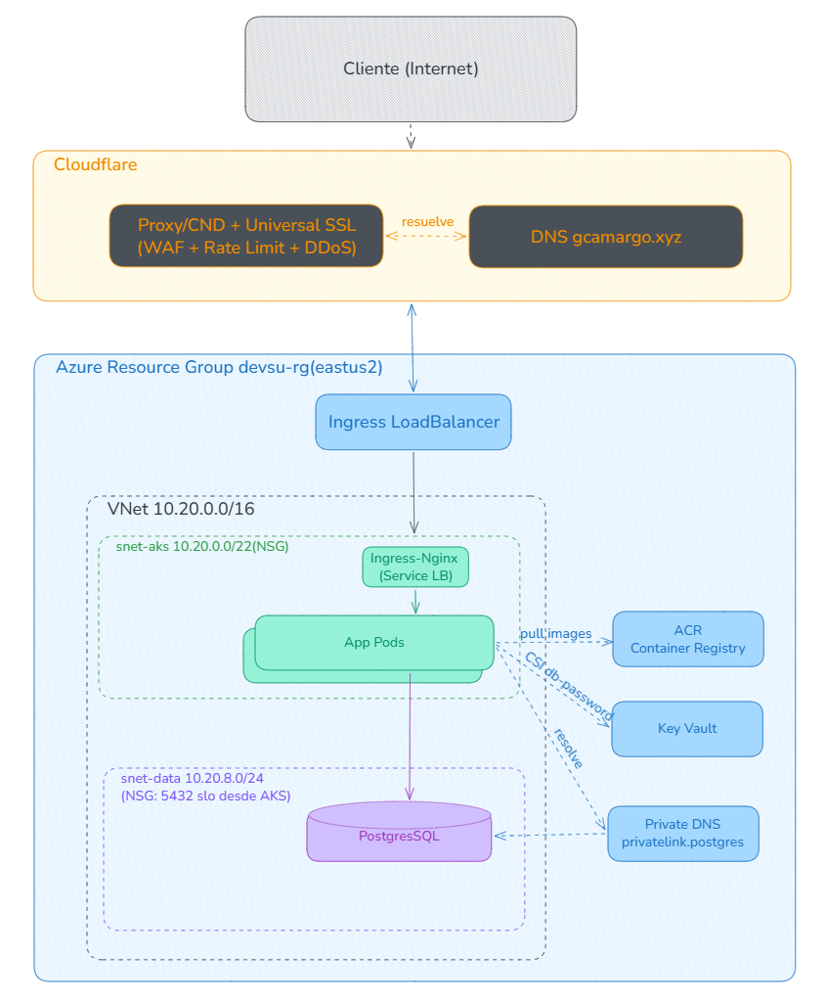

# Arquitectura

La idea general es simple de seguir si uno va por el camino de un request: entra por Cloudflare, que termina TLS y aplica WAF y rate-limit; Cloudflare reenvía al ingress de AKS por una IP pública fija; el ingress enruta al Service de la app; la app resuelve contra PostgreSQL. Cada salto agrega algo (filtrado, balanceo, política de red) y ninguno confía ciegamente en el anterior(Zero Trust).

## Diagrama




## El borde: por qué Cloudflare

La primera idea fue resolver el borde con Azure Front Door más su WAF, que era lo natural estando todo en Azure. Las cuentas de prueba no tienen habilitado Front Door. Como el requisito de fondo seguía en pie (un servicio público y sin auth necesita un borde que oculte el origen y filtre tráfico), buscamos un equivalente y caímos en Cloudflare, cuyo plan gratuito cubre justo eso sin costo: proxy con CDN, protección DDoS siempre activa, TLS de edge con Universal SSL y un WAF básico (el managed ruleset gratuito más unas pocas reglas propias).

> <font color="#cf222e">**Gotcha:**</font> Azure Front Door no esta habilitado en suscripciones de prueba, asi que aunque era la opcion natural, no fue viable. La pieza quedo escrita en Terraform pero detras de un flag apagado; en una cuenta sin esa restriccion se vuelve a Front Door prendiendolo, sin reescribir nada.

En la práctica Cloudflare queda como única puerta visible. El cliente solo ve las IPs anycast de Cloudflare, nunca la del clúster, y todo el tráfico pasa por el WAF y el rate-limit antes de tocar Azure. La definición de estos recursos vive en Terraform, en [cloudflare.tf](https://github.com/gcamargot/devsu-challenge/blob/master/terraform/cloudflare.tf), y la pieza de Front Door quedó igual en el repo pero detrás de un flag apagado ([frontdoor.tf](https://github.com/gcamargot/devsu-challenge/blob/master/terraform/frontdoor.tf)), de modo que si en una cuenta sin esa restricción se quiere volver a Front Door, alcanza con prenderlo.

## DNS en Cloudflare

Que el borde sea Cloudflare arrastra una consecuencia: el proxy gratuito solo funciona si Cloudflare es además la autoridad de DNS de la zona. El dominio sigue registrado en GoDaddy, pero sus name servers se reapuntaron a los de Cloudflare. Sobre esa zona hay dos registros, los dos en modo proxied: un `A` para `devsu-prod.gcamargo.xyz` y un `A` wildcard para `*.gcamargo.xyz`. El wildcard no es decorativo: es lo que permite que el provisioner self-service levante entornos efímeros en subdominios arbitrarios sin tocar DNS cada vez.

El propio panel del provisioner tambien queda detras de Cloudflare, publicado en `provisioner.gcamargo.xyz` (un CNAME proxied que enmascara el origen en Azure Container Apps), de modo que la unica superficie expuesta sigue siendo el borde. El detalle de ese hardening (Basic Auth, audit log, tope de entornos) vive en la pagina del provisioner.

## TLS de punta a punta

Hay dos tramos y cada uno tiene su certificado. Entre el cliente y Cloudflare se usa Universal SSL, que Cloudflare emite y renueva solo (cubre `gcamargo.xyz` y `*.gcamargo.xyz`). Entre Cloudflare y el ingress de AKS se usa un certificado Cloudflare Origin CA (wildcard, gratuito, válido únicamente para ese tramo) instalado en el ingress como secret TLS, con el modo SSL de la zona en Full (strict) para que Cloudflare valide ese certificado y no acepte un origen en claro. Si en algún momento se prefiere una CA pública en el origen, la alternativa es Let's Encrypt vía cert-manager resolviendo el desafío DNS-01 contra la API de Cloudflare.

## El clúster: AKS

El clúster es [AKS](https://github.com/gcamargot/devsu-challenge/blob/master/terraform/main.tf) con el control plane en SKU Free. El node pool quedó en `Standard_D2s_v3`, y acá hubo otra concesión a la suscripción de prueba: la primera elección fue una `Standard_B2s` (más barata, alcanzaba de sobra para una API liviana), pero la cuenta no habilita la serie B para AKS, así que pasamos a la serie D. La red usa Azure CNI con `network_policy = azure`, a diferencia de kindnet en el clúster local, Azure CNI aplica las NetworkPolicies (ver la nota en NetworkPolicy más abajo). La identidad del clúster es administrada, y la kubelet identity tiene el rol AcrPull sobre el registry para que los pods bajen imágenes sin secrets. Además están habilitados el OIDC issuer con workload identity y el addon de Key Vault (Secrets Store CSI).

## Registry, secretos y base de datos

Las imágenes viven en [ACR](https://github.com/gcamargot/devsu-challenge/blob/master/terraform/main.tf) (SKU Basic, sin usuario admin); AKS las baja por el rol AcrPull y el CD las importa desde GHCR con `az acr import`. El password de la base lo guarda [Key Vault](https://github.com/gcamargot/devsu-challenge/blob/master/terraform/keyvault.tf) y lo lee el driver CSI en runtime, que lo sincroniza a un Secret de Kubernetes vía un `SecretProviderClass` (ver el overlay [k8s/overlays/aks](https://github.com/gcamargot/devsu-challenge/tree/master/k8s/overlays/aks)).

Con la base pasó algo parecido al resto. El diseño productivo es Azure Database for PostgreSQL Flexible Server, que está escrito en [postgres.tf](https://github.com/gcamargot/devsu-challenge/blob/master/terraform/postgres.tf) y se prende con `enable_managed_pg`. Esta opcion tampoco esta disponible para la suscripcion free, así que el flag quedó en `false` y corre un PostgreSQL in-cluster como reemplazo. La app no se entera de la diferencia: apunta a `DB_HOST` y `DB_PORT` por configuración y le da igual si del otro lado hay una base administrada o un pod.

## Red interna y NetworkPolicy

Adentro del clúster la postura es default-deny con allow explícito, y es Azure CNI lo que la hace efectiva. Kyverno genera una NetworkPolicy `default-deny-ingress` en el namespace de la app, y a partir de ahí se abre lo mínimo: el ingress puede llegar a la app, y la app puede llegar a postgres. Nada más.

Vale contar una cosa que nos pasó, porque ilustra el punto. En el clúster local (kind, con kindnet) la default-deny era casi decorativa y todo funcionaba igual. Al llevarlo a AKS, con Azure CNI aplicando las políticas en serio, la app dejó de poder hablar con postgres hasta que agregamos la NetworkPolicy explícita que habilita ese tramo.

> <font color="#cf222e">**Gotcha:**</font> kindnet (el CNI por defecto de kind) no aplica NetworkPolicies, asi que una default-deny puede parecer que funciona en local y en realidad no estar filtrando nada. Azure CNI con `network_policy = azure` si las aplica de verdad: lo que en kind era decorativo, en AKS corto el trafico app-postgres hasta que abrimos ese tramo de forma explicita. No asumas que una policy testeada en kind se comporta igual en AKS.

## Segmentación de red (diseño productivo con VNet)

Viniendo de AWS, la pregunta natural es dónde está la VPC. El equivalente en Azure es la VNet, y conviene ser claros sobre cómo quedó. En el despliegue del trial, AKS corre sobre la VNet que el propio servicio crea y administra (una sola subnet, sin segmentación pensada), por dos motivos: meter el clúster en una VNet propia obliga a recrearlo, y la base administrada que más se beneficiaría de esa segmentación está apagada por la restricción del trial. La separación de tráfico que sí tenemos hoy es a nivel de pod (NetworkPolicy con Azure CNI), que cubre el east-west pero no es lo mismo que segmentar a nivel de subnet.

El diseño productivo sí define una VNet propia, escrita como IaC en [network.tf](https://github.com/gcamargot/devsu-challenge/blob/master/terraform/network.tf) detrás del flag `enable_vnet`. La idea es separar por subnets con NSGs: una para los nodos y pods de AKS (`snet-aks`) y otra para los datos (`snet-data`), esta última delegada a PostgreSQL Flexible para integrarlo a la VNet sin endpoint público. El NSG de la subnet de datos solo admite el puerto 5432 desde la subnet de AKS, y la base resuelve por una zona de DNS privada. Con eso la base deja de estar accesible desde internet (reemplaza el parche de acceso público más firewall que se usa en el trial) y el tráfico interno queda acotado también a nivel de red, no solo de pod.




Para activarlo alcanza con prender `enable_vnet` (y `enable_managed_pg` para la base privada); en una cuenta sin las restricciones del trial se aplica de entrada en un deploy desde cero.

## Hardening del origen

El edge fw no sirve de mucho si alguien puede saltárselo pegándole directo a la IP del clúster. Para cerrar eso, el origen se restringe a aceptar tráfico solo desde los rangos de IP publicados por Cloudflare, de modo que la única forma de llegar a la app sea atravesando el borde (donde están el WAF, el rate-limit y la protección DDoS). El detalle de esta restricción y su evidencia están en la página de seguridad.

## Observabilidad off-cluster

Una decision de arquitectura que conviene anotar acá es que la observabilidad no vive dentro del clúster. En vez de correr un stack Prometheus/Grafana propio (que se come CPU, memoria y disco del mismo AKS que queremos vigilar, y se cae justo cuando el clúster se cae), nos apoyamos en servicios administrados de Azure: Azure Monitor managed Prometheus para las métricas y Azure Managed Grafana para los dashboards. Dentro del clúster lo único que corre es el addon de métricas de AKS (los agentes `ama-metrics`, livianos, que scrapean y mandan a un workspace externo); el almacenamiento, la query y la visualización quedan afuera. El detalle de esa capa, el dashboard por namespace y su costo están en [Observabilidad](Observabilidad.md).

## Evidencia

> Espacio para pegar evidencia de que la arquitectura responde como se describe (reemplazar por salida real o captura):
>
> - `curl -sI https://devsu-prod.gcamargo.xyz/health` (debería responder por HTTPS a través de Cloudflare, con el header `cf-ray` presente).
> - `kubectl get pods,svc,ingress -n devsu`
> - `kubectl get networkpolicy -n devsu`
>
> ```text
> (pegar acá la salida / captura)
> ```
