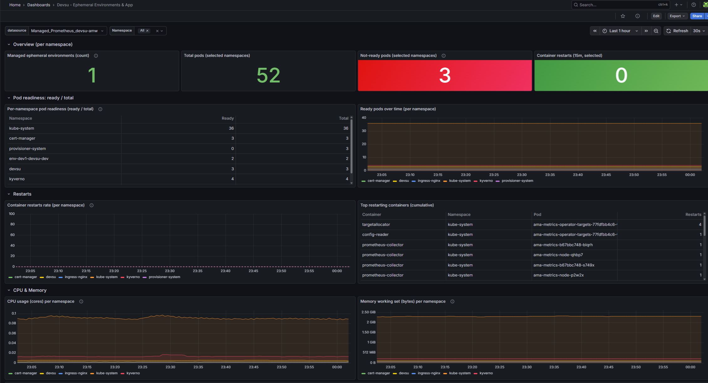

# Observabilidad

La pregunta que ordena toda esta página es dónde corre lo que mira al sistema. Lo más cómodo habría sido instalar el stack clásico Prometheus + Grafana adentro del propio AKS con un par de Helm charts, pero esa decisión tiene dos problemas que en este contexto pesan. El primero es de capacidad: el node pool del trial son dos `Standard_D2s_v3` (4 vCPU en total) y ya corren ingress-nginx, cert-manager, Kyverno, metrics-server y la app; meter ahí un servidor de Prometheus que retiene series en disco y un Grafana propio no entra sin sacrificar headroom de la app. El segundo es más sutil pero más importante: si la observabilidad vive dentro del mismo clúster que vigila, se cae justo cuando el clúster se cae, que es el momento exacto en que uno necesita los gráficos. Por las dos razones la observabilidad quedó off-cluster, apoyada en servicios administrados de Azure.

> **Nota:** esta decisión es la misma que se anota en la sección "Observabilidad off-cluster" de [Arquitectura](Arquitectura-cloud.md); acá la desarrollamos con el detalle del dashboard y el costo.

## Las tres piezas

La capa tiene tres componentes, y conviene separarlos porque cada uno hace una cosa y solo uno toca el clúster.

- **Azure Monitor managed Prometheus** (workspace `devsu-amw`) es el backend de métricas: el almacenamiento, la query y la retención. Es un Azure Monitor workspace administrado que habla el protocolo de Prometheus, así que las queries siguen siendo PromQL pero el servidor lo opera Azure, no nosotros.
- **Azure Managed Grafana** (instancia `devsu-grafana`, URL https://devsu-grafana-hng2d6cze7fhh6ae.eus2.grafana.azure.com) es la capa de visualización: un Grafana administrado, sin pods, conectado al workspace de arriba como datasource de Prometheus.
- **El addon de métricas de AKS** es lo único que corre dentro del clúster, y es deliberadamente liviano: unos agentes `ama-metrics` (un par de réplicas más un DaemonSet y kube-state-metrics) que scrapean métricas y las mandan al workspace externo. No retienen nada en el clúster, solo recolectan y empujan; el almacenamiento, la query y los dashboards quedan afuera.

Dicho de otra forma: dentro de AKS solo viven los agentes que recolectan; todo lo que consume CPU, memoria y disco de verdad (el TSDB de Prometheus, el render de Grafana) está del lado administrado de Azure, fuera del node pool al límite de quota.

> **Nota:** al habilitar el addon de managed Prometheus, Azure crea solo (no lo hace nuestra IaC) un conjunto de recursos en el resource group: el par de data collection (un `dataCollectionEndpoint` y un `dataCollectionRule`, ambos `MSProm-<region>-devsu-aks`) que cablea el scrapeo hacia el workspace, y media docena de `prometheusRuleGroups` con las recording rules estandar del mixin de Kubernetes (precomputan series caras para que los dashboards rindan). Vienen partidas por dominio (node / kubernetes / UX) y por sistema operativo, asi que aparecen tambien las variantes `-Win` aunque el cluster sea solo Linux. Son inofensivas; las tres `-Win` se pueden borrar sin consecuencia si molesta el ruido en el resource group.

## Por qué off-cluster

Ya lo adelantamos, pero vale dejarlo explícito porque es la justificación de la arquitectura entera. El node pool del trial está al límite de su quota (2x `Standard_D2s_v3`, 4 vCPU), así que no hay lugar para un Prometheus server más un Grafana propio sin desalojar a la app o a los add-ons. Empujando el almacenamiento y la visualización afuera, lo que queda adentro son agentes que pesan poco y entran en el headroom que sí tenemos. Como bonus, la observabilidad sobrevive a una caída del clúster, que es cuando más la necesitamos.

> **Atencion:** esta capa es la pieza más cara del despliegue. Azure Managed Grafana en plan Standard ronda los 65 USD/mes flat (se paga por la instancia activa, no por uso), y sumando el ingest de Prometheus administrado el total queda en el orden de ~70 USD/mes. Por eso la regla es apagarla cuando no se usa: en un trial el Grafana es el primer recurso a destruir cuando se cierra la ventana. El desglose por componente está en [Costos y FinOps](Costos-y-FinOps.md).

## Acceso: Entra SSO

No hay un usuario y password propios de Grafana. Managed Grafana se integra con Entra ID (Azure AD), así que el login es por SSO con la cuenta de Azure, y el permiso se otorga por roles de Azure sobre el recurso, no por usuarios internos de Grafana. Al operador del trial se le asignó el rol **Grafana Admin** sobre la instancia, que permite ver y editar dashboards. Para sumar a alguien que solo necesita mirar, alcanza con un role assignment de `Grafana Viewer` sobre el recurso, sin tocar nada dentro de Grafana.

> **Tip:** dar de alta un viewer es un solo comando: `az role assignment create --assignee <upn-o-objectId> --role "Grafana Viewer" --scope <grafana-resource-id>`. Al ser por RBAC de Azure, se audita y se revoca con las mismas herramientas que el resto de la suscripción.

## El dashboard: "Devsu - Ephemeral Environments & App"

El dashboard propio que armamos se llama "Devsu - Ephemeral Environments & App" y la idea es que con una sola pantalla se vea el estado de cada instancia del provisioner sin tener que ir pod por pod. Está organizado **por namespace** mediante una variable de template `$namespace`, que por defecto matchea los entornos efímeros `env-*` que crea el provisioner (los namespaces `env-<group>-<subdomain>` etiquetados como gestionados) más el namespace `devsu` de la app productiva. Por cada namespace muestra:

- **Pods ready / total**: cuántos pods están listos contra cuántos hay, en tabla y en serie temporal. Es la misma lectura de readiness que el provisioner expone en su tabla de entornos activos, pero acá con historia.
- **Restarts**: los reinicios de contenedores en una ventana corta, para detectar un CrashLoop antes de que alguien lo reporte.
- **CPU**: el consumo de CPU agregado por namespace, en cores.
- **Memoria**: el working set de memoria por namespace, en bytes.

La combinación es exactamente la que sirve para mirar la salud de cada entorno efímero del provisioner: si un `env-*` levantó bien (pods ready), si está estable (sin restarts) y cuánto está consumiendo (CPU/memoria), todo cruzado contra el `devsu` productivo como referencia. Además del dashboard propio, Azure auto-provisiona en el mismo Grafana el set de dashboards built-in de AKS (Kubernetes, Compute Resources, Namespace, Node Exporter), que cubren el drill-down más profundo sin costo extra.

> **Nota:** hubo un detalle fino con la métrica de readiness. El addon de AKS arranca con `minimalingestionprofile=true` para abaratar el ingest, y ese perfil mínimo descarta `kube_pod_status_ready`. Para que el panel de "pods ready" sea exacto, agregamos esa métrica de vuelta encima del perfil mínimo con un ConfigMap (`kube-system/ama-metrics-settings-configmap`), versionado en la carpeta `observability/`. El dashboard de todas formas tiene un fallback a `kube_pod_status_phase{phase="Running"}` por si esa métrica no estuviera ingestada.

## IaC y dónde vive todo

La capa está escrita como infraestructura como código en [terraform/monitoring.tf](https://github.com/gcamargot/devsu-challenge/blob/master/terraform/monitoring.tf): el Azure Monitor workspace, la cadena DCE/DCR que conecta el addon de métricas al workspace, la instancia de Managed Grafana con su identidad administrada y los role assignments (la identidad de Grafana lee del workspace, y el operador queda como Grafana Admin). Todo eso está gateado por el flag `enable_monitoring` (definido en [terraform/variables.tf](https://github.com/gcamargot/devsu-challenge/blob/master/terraform/variables.tf)), que viene apagado por default.

> **Verificado:** a diferencia de Front Door, la base administrada o la serie B de VMs, la observabilidad administrada sí está disponible en la suscripción de prueba. En el trial se aplicó por `az` CLI en vez de `terraform apply` (para respetar la restricción de no correr Terraform contra la cuenta), así que el `monitoring.tf` quedó escrito y validado pero no aplicado; en un entorno desde cero se prende con `enable_monitoring=true`.

El material complementario vive en la carpeta [observability/](https://github.com/gcamargot/devsu-challenge/tree/master/observability): el README con el detalle de lo que se provisionó y cómo, el JSON del dashboard ([observability/dashboards/devsu-environments.json](https://github.com/gcamargot/devsu-challenge/blob/master/observability/dashboards/devsu-environments.json)) para reimportarlo cuando haga falta, y el keep-list de métricas ([observability/ama-metrics-settings-configmap.yaml](https://github.com/gcamargot/devsu-challenge/blob/master/observability/ama-metrics-settings-configmap.yaml)) que ajusta el perfil de ingest.

## Cómo se usa en la operación

El acceso al dashboard y la lectura del estado en el día a día están en el runbook, en [Operacion](Operacion.md). La idea de uso es simple: para una mirada rápida del estado de un entorno alcanza con la tabla del propio provisioner (que lee la readiness en vivo del clúster y no depende de Grafana); cuando se necesita historia, comparar entre entornos o ver CPU y memoria en el tiempo, ahí entra Grafana.

## Evidencia

El dashboard "Devsu - Ephemeral Environments & App" corre en Azure Managed Grafana, con la variable `$namespace` cruzando los entornos efimeros `env-*` contra el `devsu` productivo y mostrando pods ready/total, restarts, CPU y memoria. Significa que la observabilidad off-cluster funciona de punta a punta: el Grafana administrado lee del workspace de Prometheus administrado y muestra datos reales, sin nada pesado corriendo dentro del cluster. Se reproduce entrando por Entra SSO a https://devsu-grafana-hng2d6cze7fhh6ae.eus2.grafana.azure.com con el rol Grafana Admin.
