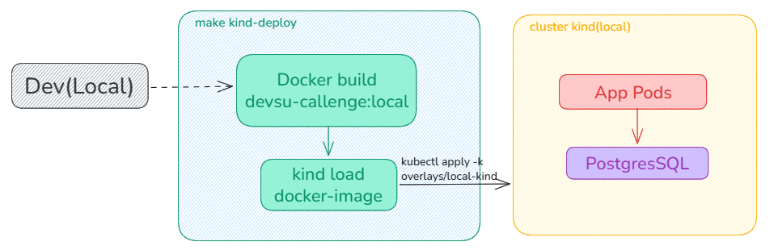
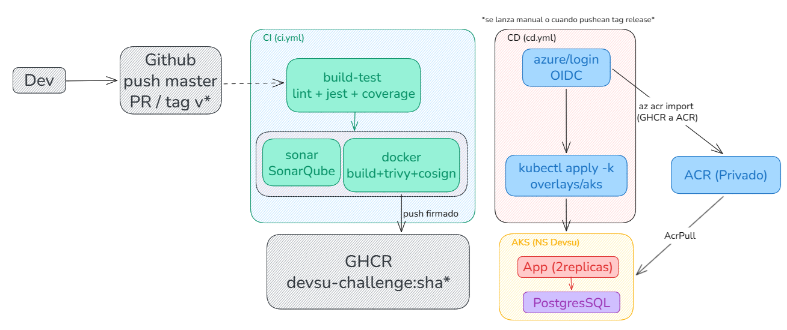

# Pipeline CI/CD

Esta página es la referencia del pipeline: el detalle de cada job y cada etapa, los triggers, la estrategia de tags y el manejo de secretos. La narrativa de por qué quedó armado así (las decisiones de fondo, lo que nos fue pasando) vive en [Procedimiento 2 ci](Procedimiento-2-ci.md) para el lado de integración y en [Procedimiento 4 infra azure](Procedimiento-4-infra-azure.md) para el despliegue; acá nos quedamos con el qué hace cada cosa, para tenerlo a mano cuando hay que tocarlo.

Armamos dos pipelines separados en GitHub Actions y la separación es deliberada. [ci.yml](https://github.com/gcamargot/devsu-challenge/blob/master/.github/workflows/ci.yml) integra: construye, valida y publica la imagen en GHCR. [cd.yml](https://github.com/gcamargot/devsu-challenge/blob/master/.github/workflows/cd.yml) despliega a AKS. El criterio es que CI no toque nunca la nube (no tiene credenciales de Azure) y que todo el acceso a Azure quede concentrado en CD, autenticado por OIDC. Así, un cambio de código que rompa algo en CI no tiene forma de tocar producción, y el blast radius de un token comprometido en CI se limita a GHCR.

Conviene aclarar desde el arranque que hay dos caminos distintos para llegar a un cluster y que no son simétricos. A DEV (kind, local) se va por fuera de GitHub Actions, con el Makefile, porque kind corre en la máquina del que desarrolla y no hay forma de que un runner de GitHub le pushee. A PROD (AKS) se va por el pipeline completo. Los dos diagramas del final muestran cada flujo por separado.

## CI - flujo de integración

El workflow corre con `working-directory: app` por defecto en el job de build, porque el código de la aplicación vive bajo `app/` y el resto del repo (k8s, terraform) no participa de la integración.

### Triggers

Dispara en `push` a `master` y a `develop`, en cualquier `pull_request`, y a mano con `workflow_dispatch`. La diferencia entre PR y push importa más adelante (en el job de docker): los PR construyen y escanean la imagen pero no la publican, los push a rama sí. Es la forma de validar un PR sin ensuciar GHCR con imágenes de ramas que quizá nunca se mergeen.

### Job 1 - build-test (build, lint, test y coverage)

Corre sobre `ubuntu-latest` con Node 22 y cache de npm apuntando a `app/package-lock.json`. La secuencia es:

1. Checkout (`actions/checkout@v6`).
2. Setup de Node 22 (`actions/setup-node@v6`) con el cache de dependencias.
3. Install: `npm ci`, instalación reproducible desde el lockfile (no `npm install`, que puede mover versiones).
4. Lint: `npm run lint` (ESLint con flat config en `app/eslint.config.js`).
5. Tests + coverage: `npm run test:coverage` (Jest, cobertura en formato `text` y `lcov`).
6. Upload del coverage: sube `app/coverage/lcov.info` como artifact `coverage`, con `if-no-files-found: error`. Ese flag es para que si por algún cambio dejara de generarse el reporte, queremos que el job falle ahí y no que Sonar reciba después una cobertura vacía sin que nadie se entere.

### Job 2 - sonar (análisis estático, SonarQube Cloud)

Depende de `build-test` (`needs: build-test`) porque necesita el artifact de coverage que produce el job anterior.

1. Checkout con `fetch-depth: 0`. El historial completo hace falta para que Sonar haga el blame por línea (quién tocó qué y cuándo); sin eso, el análisis de código nuevo vs. existente queda ciego.
2. Download del artifact `coverage` a `app/coverage`.
3. Scan: `SonarSource/sonarqube-scan-action@v6` contra `SONAR_HOST_URL=https://sonarcloud.io`. La configuración del proyecto (projectKey `gcamargot_devsu-challenge`, organización `gcamargot`, fuentes, tests y el `sonar.javascript.lcov.reportPaths`) está en [sonar-project.properties](https://github.com/gcamargot/devsu-challenge/blob/master/sonar-project.properties).
4. El paso solo corre si `SONAR_TOKEN` está configurado (`if: ${{ env.SONAR_TOKEN != '' }}`). Lo dejamos condicional para que el pipeline quede verde en un fork que no tenga el token, sin volverlo un requisito duro para cualquiera que clone el repo.

> <font color="#cf222e">**Gotcha:**</font> SonarCloud venia mirando la rama "main" como principal, pero la rama default del repo es `master`. Mientras estuvieron desalineadas, el analisis de codigo nuevo vs. existente apuntaba a la rama equivocada y el quality gate no reflejaba lo que de verdad se mergeaba. Se corrigio renombrando el main branch en SonarCloud a `master`; si en algun momento el analisis vuelve a verse vacio o desfasado, revisar primero que la rama principal en Sonar siga siendo la default del repo.

### Job 3 - docker (build, scan y push de la imagen)

También depende de `build-test`. Permisos acotados: `contents: read` y `packages: write` (lo justo para publicar en GHCR).

1. Checkout y setup de Buildx (`docker/setup-buildx-action@v3`).
2. Login a GHCR (`docker/login-action@v3`) usando `github.actor` y el `GITHUB_TOKEN` automático. No hay un PAT guardado: el token efímero del run alcanza para publicar en el GHCR del propio repo.
3. Metadata de la imagen (`docker/metadata-action@v5`), que calcula los tags (ver más abajo).
4. Build con `docker/build-push-action@v6` y `load: true`. Acá está la parte fina: construimos y cargamos la imagen en el daemon local sin publicarla todavía. La idea es escanear antes de publicar, no después. Usamos cache de GitHub Actions (`cache-from`/`cache-to: type=gha,mode=max`) para que los builds sucesivos no rearmen capas que no cambiaron.
5. Install de Trivy desde el script oficial de Aqua Security.
6. Scan: `trivy image --severity HIGH,CRITICAL --ignore-unfixed --exit-code 1 <tag>`. Esto es un gate, no un informe: si aparece una vulnerabilidad HIGH o CRITICAL que tenga fix disponible, el job falla y la imagen no se publica. El `--ignore-unfixed` es para no trabarnos con CVEs que todavía no tienen parche upstream (no hay nada accionable, solo ruido). Para llegar a 0 hallazgos fixables HIGH/CRITICAL terminamos sacando del runtime el `package-lock.json` y el propio `npm` (no se necesitan para correr, y arrastraban CVEs), algo que está contado en [Procedimiento 1 app y contenedor](Procedimiento-1-app-y-contenedor.md).
7. Push a GHCR, solo si el evento no es un pull request (`if: ${{ github.event_name != 'pull_request' }}`). Los PR llegan hasta el scan; los push a rama publican.

> <font color="#0969da">**Nota:**</font> el Trivy del paso 6 es un gate, no un informe. La imagen se construye y se carga en el daemon local pero no se publica hasta despues del scan, asi que un HIGH/CRITICAL con fix disponible falla el job y la imagen nunca llega a GHCR. El `--ignore-unfixed` deja pasar solo lo que todavia no tiene parche upstream (no hay nada accionable), nunca lo que si se puede corregir.

### Estrategia de tags

`docker/metadata-action` genera, sobre `ghcr.io/gcamargot/devsu-challenge`, este juego de tags:

- `type=sha,prefix=sha-` produce `sha-<gitsha>`. Es un tag inmutable por commit y es el que usa el CD para saber exactamente qué se despliega. Un `sha-` siempre apunta al mismo bit de imagen.
- `type=ref,event=branch` produce el nombre de la rama (`master`, `develop`). Sirve para tener un "último de esta rama" pero es mutable, así que no lo usamos para deploy.
- `type=semver,pattern={{version}}` produce `X.Y.Z` cuando se pushea un tag de release `vX.Y.Z`.
- `type=raw,value=latest,enable={{is_default_branch}}` produce `latest`, pero solo desde la rama default.

La regla práctica que seguimos es: para deployar siempre referenciamos el `sha-`, nunca `latest`. El tag mutable es comodidad para mirar, no para promover.

### Secretos en CI

- `SONAR_TOKEN`: secret del repositorio, habilita el análisis de Sonar. Es opcional (el job lo saltea si no está).
- `GITHUB_TOKEN`: lo provee GitHub Actions automáticamente en cada run y es lo que autentica el push a GHCR. No hay nada que rotar a mano.

No hay credenciales de Azure en CI. Esto es intencional y es la mitad del argumento por el que CI y CD están separados.

## CD - flujo de despliegue

### Triggers

Dispara a mano con `workflow_dispatch` (con un input opcional `image_tag`, que por defecto resuelve a `sha-<commit acortado>`) y automáticamente al pushear un tag `v*` de release. Permisos: `id-token: write` (para que GitHub pueda emitir el token OIDC) y `contents: read`. El job corre en el `environment: production`, que es donde están cargadas las variables y donde se pueden poner reglas de aprobación si hicieran falta.

### Etapas

1. Checkout.
2. Resolve del image tag: si vino `inputs.image_tag` se usa ese; si no, se arma `sha-$(git sha | cut -c1-7)`. El default cubre el caso común (deployar el commit actual) sin tener que copiar y pegar el sha a mano.
3. Azure login por OIDC (`azure/login@v2`), con `client-id`, `tenant-id` y `subscription-id` tomados de `vars.AZURE_CLIENT_ID`, `vars.AZURE_TENANT_ID` y `vars.AZURE_SUBSCRIPTION_ID`. GitHub presenta un token OIDC, Azure lo valida contra la federated credential configurada en la identidad, y devuelve un token de acceso con expiracion corta. No hay client secret almacenado en ningún lado, que es justo lo que queríamos evitar.
4. Import de la imagen a ACR: `az acr import` copia la imagen que CI ya dejó en GHCR (`ghcr.io/<repo>:<tag>`) hacia el ACR como `devsu-challenge:<tag>`, con `--force`. Después AKS la baja vía el rol AcrPull, sin secrets de registry en el cluster.
5. Get de credenciales de AKS: `az aks get-credentials --admin --overwrite-existing` contra `vars.RESOURCE_GROUP` y `vars.AKS_NAME`.
6. Render de los placeholders del overlay: en [k8s/overlays/aks](https://github.com/gcamargot/devsu-challenge/tree/master/k8s/overlays/aks) un `sed` reemplaza los placeholders `__UPPER__` (login server del ACR, FQDN de postgres, host del origin, dominio, RG, subscription y tenant id, nombre y client id de Key Vault, client id de cert-manager, email de ACME) por los valores de `vars.*`. Después `kustomize edit set image` fija la imagen al `<ACR>/devsu-challenge:<tag>` resuelto. La razón de usar placeholders es no commitear ids de suscripción ni FQDN en el repo, y poder reconstruirlos desde `terraform output`.
7. Apply: `kubectl apply -k k8s/overlays/aks` seguido de `kubectl -n devsu rollout status deploy/devsu-demo --timeout=180s`. El `rollout status` con timeout es el que convierte el deploy en algo que puede fallar: si los pods nuevos no quedan listos en 180s, el job se marca rojo en vez de dar por exitoso un deploy que en realidad no levantó.

### Manejo de secretos y configuración en CD

- Autenticación: OIDC (federated identity), sin client secret en el repositorio. El detalle de cómo se configura la federated credential está en [Procedimiento 4 infra azure](Procedimiento-4-infra-azure.md).

> <font color="#1a7f37">**Tip:**</font> el login a Azure es por OIDC contra una federated credential atada al repo y a la rama exacta, asi que no hay ningun client secret de larga vida guardado en GitHub. No hay credencial robable que, si se filtra, de acceso permanente a la nube: el token que presenta GitHub Actions es efimero y se valida en cada run.
- Variables (`vars.*`): valores no sensibles del entorno (nombres de recursos, FQDN, ids) que se cargan una sola vez desde `terraform output` como Variables del environment `production`. Las tratamos como configuración, no como secretos, porque no abren nada por sí solas.
- Password de la base: no viaja por el pipeline. El overlay `aks` referencia un `SecretProviderClass` que el Secrets Store CSI driver de AKS usa para leer `db-password` directamente de Key Vault en runtime y materializarlo como Secret de Kubernetes. El pipeline nunca ve la contraseña.

## Relación entre CI y CD

La frontera entre los dos pipelines es el registro de imágenes. CI publica en GHCR (el registro de artefactos del repo) y ahí termina su responsabilidad. CD promueve esa imagen a ACR (el registro privado del cluster) y la despliega. Es un patrón de promoción: la imagen no se vuelve a construir entre CI y CD, se mueve el mismo bit verificado de un registry a otro. Eso mantiene a CI sin permisos sobre Azure y deja el único punto de acceso a la nube en el job de CD federado por OIDC.

## Controles previos al pipeline (pre-commit)

Antes de que el CI llegue a correr hay una primera línea de validación local. [.pre-commit-config.yaml](https://github.com/gcamargot/devsu-challenge/blob/master/.pre-commit-config.yaml) define hooks que corren en el commit (`pre-commit install` una vez tras clonar): `trailing-whitespace`, `end-of-file-fixer`, `check-yaml` (multi-documento, porque los manifests de k8s lo son), `check-json`, `check-merge-conflict`, `check-added-large-files` (máximo 1 MB), `mixed-line-ending` y un hook local de ESLint sobre `app/`. La idea es atajar lo trivial antes de gastar un run de Actions en ello.

## Diagrama: flujo a DEV (kind)

El camino a DEV no pasa por GitHub Actions. kind corre en la máquina local, así que se opera con el [Makefile](https://github.com/gcamargot/devsu-challenge/blob/master/Makefile): `make kind-deploy` construye la imagen local, la carga al cluster kind con `kind load docker-image` y aplica el overlay [k8s/overlays/local-kind](https://github.com/gcamargot/devsu-challenge/tree/master/k8s/overlays/local-kind). No hay GHCR ni ACR de por medio: el overlay usa directamente la imagen `devsu-demo:local` que se cargó al nodo.




## Diagrama: flujo a PROD (AKS)

El camino a PROD sí es el pipeline completo. Un push a `master` (o un PR) dispara CI, que construye, valida, escanea y publica la imagen en GHCR. Después, a mano (`workflow_dispatch`) o con un tag de release, CD toma esa imagen, la importa a ACR vía OIDC y aplica el overlay de AKS. El borde (Cloudflare) queda delante del ingress, como se ve en [Arquitectura cloud](Arquitectura-cloud.md).




El camino de runtime (como llega el usuario: Cloudflare al frente del ingress) no se muestra aca a proposito: vive en [Arquitectura](Arquitectura-cloud.md), para no mezclar el flujo de despliegue con el de trafico.

## Evidencia

> <font color="#0969da">**Evidencia:**</font> espacio para pegar la evidencia de que los pipelines corren como se describe (reemplazar por links a runs reales o capturas):
>
> - Run de CI verde en Actions (build-test + sonar + docker, con el push a GHCR): `https://github.com/gcamargot/devsu-challenge/actions/workflows/ci.yml`
> - Run de CD verde en Actions (login OIDC, az acr import y rollout status OK): `https://github.com/gcamargot/devsu-challenge/actions/workflows/cd.yml`
> - Imagen publicada en GHCR con el tag `sha-<commit>` y, opcionalmente, la salida de `trivy image --severity HIGH,CRITICAL --ignore-unfixed <tag>` mostrando 0 hallazgos fixables.
>
> ```text
> (pegar acá los links a los runs / la salida / la captura)
> ```
