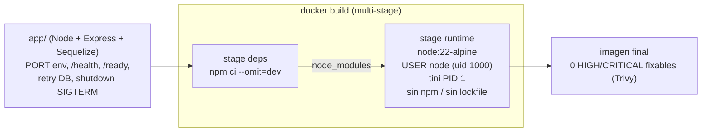

# Procedimiento 1: la app y el contenedor

Esta es la primera etapa de la bitácora, y arranca por lo más concreto: qué nos dieron de base, qué le faltaba para ser deployable y cómo terminamos con una imagen que se puede subir a producción. Todo lo que viene después (Kubernetes, el borde, el CI/CD) se apoya en que esta capa quedara sólida.

## El punto de partida y por qué Node

El material base venía como una de tres implementaciones equivalentes del mismo servicio (Java, Node y Python), todas exponiendo la misma API REST de usuarios con los campos `dni` y `name` sobre `/api/users`. Elegimos la de Node, y la decisión fue por lo que abarata el ciclo de trabajo de punta a punta. El toolchain local es liviano (no hace falta una JVM ni un entorno de build pesado para levantar la app), el CI corre rápido (instalar dependencias y correr tests con jest es cuestión de segundos, no de minutos esperando que compile), y la imagen final queda chica, que es lo que más nos importaba pensando en un registry, en los pulls de cada nodo y en la superficie de ataque del contenedor. Para una API liviana y sin estado propio, Node nos daba el mejor balance entre velocidad de iteración y peso del artifact.

Ahora bien, "elegir Node" no quería decir "tomar la app tal cual y empaquetarla". El starter funcionaba como demo pero tenía varias cosas que en producción se nos iban a volver en contra, y antes de pensar en el Dockerfile las corregimos una por una.

## Qué corregimos en la app y por qué

La app vive en [app/](https://github.com/gcamargot/devsu-challenge/tree/master/app), y el grueso de los cambios se concentra en el arranque y en la capa de base de datos. Conviene listarlos con el razonamiento detrás de cada uno, porque casi todos salieron de imaginar qué pasaba el día que la app corriera en un clúster.

**`PORT` por variable de entorno.** El puerto estaba fijo en el código. Lo pasamos a leerse de `process.env.PORT` con un default razonable, porque el contenedor y los manifiestos de Kubernetes necesitan poder fijarlo desde afuera sin tocar el código. Se ve en [app/index.js](https://github.com/gcamargot/devsu-challenge/blob/master/app/index.js), donde `const PORT = process.env.PORT || 8000`.

**Sacar `sequelize.sync({ force: true })`.** Este era el más peligroso de todos. El starter sincronizaba el esquema con `force: true`, que dropea y recrea las tablas en cada arranque. En una demo no se nota, pero en un Deployment con réplicas que se reinician, que escala, que recibe rolling updates, eso significa perder los datos en cada boot de cualquier pod. Lo cambiamos por un `sequelize.sync()` a secas, que crea la tabla si no existe y no toca nada si ya está. Quedó comentado en el código justamente para que nadie lo vuelva a poner.

> <font color="#cf222e">**Gotcha:**</font> el `sequelize.sync({ force: true })` del starter borraba y recreaba las tablas en cada arranque de pod. Inofensivo en una demo de un solo proceso, catastrófico en un Deployment con réplicas, escalado y rolling updates: cada boot se llevaba puestos los datos. Es el cambio de mayor impacto de toda esta etapa y por eso quedó comentado en el código, para que nadie lo reintroduzca.

**`/health` y `/ready` separados.** No había health checks. Agregamos dos endpoints con responsabilidades distintas, que viven en [app/health/health.js](https://github.com/gcamargot/devsu-challenge/blob/master/app/health/health.js). El `/health` es la liveness: responde 200 si el proceso está vivo y a propósito no chequea dependencias, porque no queremos que una base lenta o intermitente dispare reinicios del pod. El `/ready` es la readiness: hace un `sequelize.authenticate()` y solo responde 200 si la base contesta de verdad, devolviendo 503 si no. Esa distinción es la que permite que Kubernetes saque un pod de balanceo cuando perdió la base sin matarlo, y que no le mande tráfico hasta que esté en condiciones de atenderlo.

**Dialect `sqlite`/`postgres` configurable por entorno.** La capa de base, en [app/shared/database/database.js](https://github.com/gcamargot/devsu-challenge/blob/master/app/shared/database/database.js), elige el motor según `DB_DIALECT`, y si no está seteado usa `postgres` cuando `NODE_ENV` es production y `sqlite` en cualquier otro caso. Esto nos da lo mejor de los dos mundos: los tests y el desarrollo local corren contra sqlite en memoria (rápido, sin levantar nada) y producción habla postgres, con los parámetros de conexión (`DB_HOST`, `DB_PORT`, `DB_NAME`, `DB_USER`, `DB_PASSWORD`) viniendo todos del entorno para que nada quede horneado en el build.

**Reintento de conexión en el arranque.** En el starter, si la base no estaba lista en el momento exacto en que arrancaba la app, la promesa rechazada se volvía un unhandled rejection y mataba el proceso. En un clúster eso es una carrera perdida casi siempre, porque el pod de la app puede levantar antes que la base. Envolvimos la inicialización en un loop de reintentos (diez intentos con espera entre cada uno) de modo que una base que tarda un poco más en estar disponible no tumbe el pod; mientras tanto la liveness sigue respondiendo y la readiness mantiene al pod fuera de balanceo hasta que la base aparece. La lógica está en `initDb()` dentro de [app/index.js](https://github.com/gcamargot/devsu-challenge/blob/master/app/index.js).

**Shutdown ordenado en `SIGTERM`.** Cuando Kubernetes saca un pod (un rolling update, un scale-down) le manda un `SIGTERM`. Sin manejarlo, el proceso muere de golpe y puede cortar requests en vuelo. Agregamos un handler que cierra primero el servidor HTTP (dejando terminar lo que está en curso) y después el pool de la base, antes de salir limpio. Está enganchado tanto a `SIGTERM` como a `SIGINT`.

**Bump de dependencias y `sqlite3` a devDependency.** Subimos express a 4.21 y sequelize a 6.37 para salir de versiones con CVEs conocidos, y movimos `sqlite3` a `devDependencies`. Como la imagen de producción se construye con `npm ci --omit=dev`, sqlite3 (que tiene binarios nativos y arrastra CVEs propios) directamente no llega al runtime. Producción habla postgres, así que sqlite solo hace falta para tests y desarrollo, y mantenerlo fuera del artefacto final baja tanto el peso como la superficie de vulnerabilidades. Las versiones están en [app/package.json](https://github.com/gcamargot/devsu-challenge/blob/master/app/package.json).

## El Dockerfile

Con la app en condiciones, el [Dockerfile](https://github.com/gcamargot/devsu-challenge/blob/master/Dockerfile) se ocupa de empaquetarla bien. Es multi-stage sobre `node:22-alpine`, y cada decisión apunta a una imagen chica y hardenizada.

La primera etapa (`deps`) instala únicamente las dependencias de producción con `npm ci --omit=dev`. La segunda (`runtime`) copia el código y esos `node_modules` ya resueltos, sin arrastrar nada del entorno de build. Un par de detalles que importan:

- **Corre como usuario `node` (uid 1000).** Ese usuario ya viene en la imagen base, así que no lo creamos: copiamos los archivos con `--chown=node:node` y hacemos `USER node` antes del entrypoint. Nada corre como root, que es justo lo que después Kyverno va a exigir en el clúster.
- **`tini` como PID 1.** El entrypoint es `/sbin/tini --`, de modo que tini sea el proceso 1 y se ocupe de reenviar señales (el `SIGTERM` llega limpio a node, que es lo que hace funcionar el shutdown ordenado) y de reapear zombies. Sin esto, node como PID 1 maneja mal las señales.
- **`HEALTHCHECK` contra `/health`.** El propio contenedor sabe reportar si está sano, con un `wget` a `127.0.0.1:8000/health`. Esto sirve en docker-compose y en cualquier runtime que respete el healthcheck de la imagen.
- **Sacar `package-lock.json` y `npm` del runtime.** Después de instalar, borramos el lockfile y desinstalamos npm/npx de la imagen final. La razón es doble: achica la imagen y, sobre todo, saca de circulación las dependencias que npm trae empaquetadas, que eran una fuente importante de CVEs reportados por el scanner aunque nunca se ejecutaran. En producción no necesitamos npm para nada, así que afuera.

### Cómo llegamos a 0 HIGH/CRITICAL fixables en Trivy

El scan de la imagen con Trivy (que en el pipeline es un gate sobre HIGH y CRITICAL, con `--ignore-unfixed` para no frenar por cosas que no tienen arreglo disponible) fue lo que cerró el círculo. La combinación de cambios (base alpine, solo dependencias de producción, sqlite3 fuera del runtime y, el que más movió la aguja, sacar npm y su árbol de dependencias del artefacto) nos dejó en cero vulnerabilidades HIGH/CRITICAL fixables. El detalle del gate y de cómo se corre en CI está en la página de Pipeline CI/CD; lo que importa acá es que el resultado salió del diseño de la imagen, no de un parche posterior.

> <font color="#1a7f37">**Verificado:**</font> `trivy image --severity HIGH,CRITICAL --ignore-unfixed` sobre la imagen final devuelve 0 vulnerabilidades fixables. El cero no es un parche puntual sino consecuencia del diseño (alpine, solo prod deps, sqlite3 fuera del runtime, npm desinstalado), así que se sostiene rebuild tras rebuild.

> <font color="#1a7f37">**Tip:**</font> sacar `npm`/`npx` y el lockfile del runtime fue lo que más movió la aguja en el conteo de CVEs. Buena parte de los HIGH/CRITICAL reportados venían del árbol de dependencias que npm trae empaquetado, aunque nunca se ejecutara en producción. Si una imagen Node arrastra CVEs que no se explican por la app, mirá primero qué deja npm adentro.

## Pre-commit y docker-compose

Dos piezas más cierran el flujo de trabajo local.

El [.pre-commit-config.yaml](https://github.com/gcamargot/devsu-challenge/blob/master/.pre-commit-config.yaml) corre eslint sobre la app antes de cada commit (más una tanda de hooks genéricos: trailing whitespace, fin de archivo, validación de YAML/JSON, merge conflicts). La idea es que el lint falle en la máquina del que commitea y no recién en el CI, que es más lento y más caro de iterar. Se activa con `pre-commit install` una vez después de clonar.

El [docker-compose.yml](https://github.com/gcamargot/devsu-challenge/blob/master/docker-compose.yml) levanta la app junto a un `postgres:16-alpine` para poder ejercitar localmente el mismo camino que va a usar en el clúster (la app con `DB_DIALECT=postgres` apuntando al contenedor de la base). Tiene un healthcheck con `pg_isready` y un `depends_on` con `condition: service_healthy`, así la app no arranca antes de que la base esté lista. Es la forma más rápida de validar que el path de postgres funciona sin necesitar Kubernetes.

## Diagrama




## Evidencia

> <font color="#0969da">**Evidencia:**</font> espacio para pegar la evidencia de esta etapa (reemplazar por salida real o captura):
>
> - `cd app && npm test` (la suite de jest debería pasar en verde contra sqlite en memoria).
> - `cd app && npm run test:coverage` (reporte de cobertura).
> - `docker build -t users-api:local .` seguido de `docker run --rm -p 8000:8000 users-api:local` y, en otra terminal, `curl -s http://127.0.0.1:8000/health` (debería devolver `{"status":"ok"}`).
> - `docker exec <container> id` (debería mostrar `uid=1000(node)`, confirmando que no corre como root).
> - `trivy image users-api:local --severity HIGH,CRITICAL --ignore-unfixed` (debería listar 0 vulnerabilidades).
>
> ```text
> (pegar acá la salida / captura)
> ```
