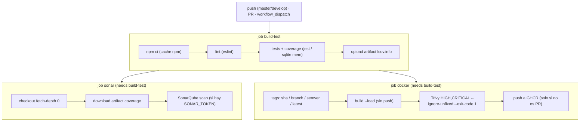
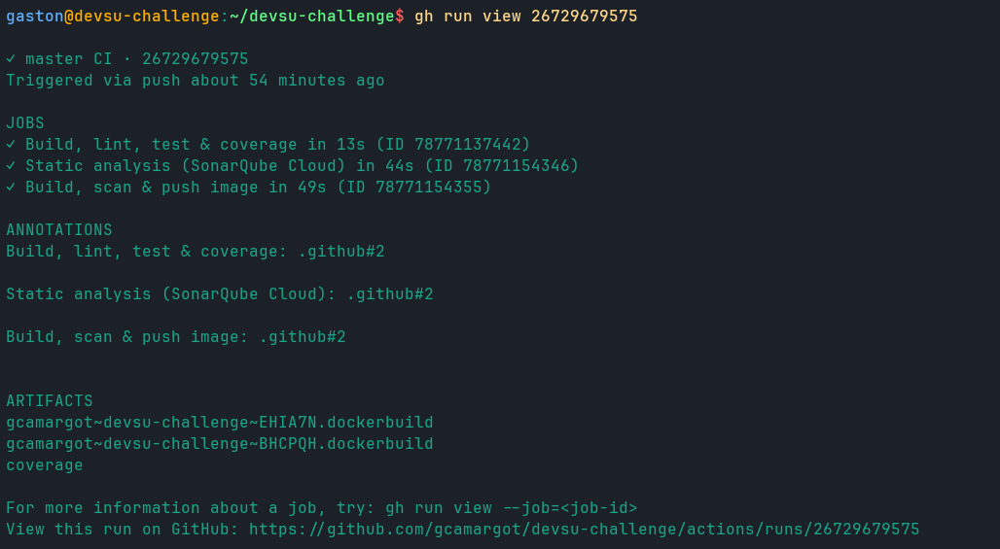

# Procedimiento 2: la etapa de integración (CI)

Con la app y la imagen ya resueltas (lo contamos en [Procedimiento 1 app y contenedor](Procedimiento-1-app-y-contenedor.md)), la siguiente etapa de la bitácora es la de integración continua: qué corre cada vez que alguien empuja código y por qué. La idea que nos guió fue que el CI tenía que ser una red de contención real, no un trámite verde. Cada paso ataca una clase distinta de problema (estilo, regresiones, deuda y bugs latentes, vulnerabilidades del contenedor) y, salvo el push de la imagen, todos corren también en los pull requests, que es donde queremos enterarnos de las cosas antes del merge y no después.

El workflow vive en [.github/workflows/ci.yml](https://github.com/gcamargot/devsu-challenge/blob/master/.github/workflows/ci.yml) y se dispara en `push` a `master` y `develop`, en cualquier `pull_request` y a mano con `workflow_dispatch`. Está partido en tres jobs (`build-test`, `sonar`, `docker`), y ese reparto no es cosmético: nos permite que el análisis estático y el build de imagen arranquen en paralelo apenas pasan los tests, en vez de encadenar todo en una sola tirada lenta.

## El job base: build, lint, tests y coverage

El primer job, `build-test`, es el tronco del que cuelga el resto (los otros dos lo declaran como `needs`). Si esto no pasa, no tiene sentido gastar minutos en analizar ni en construir nada.

Corre sobre `ubuntu-latest` con `working-directory: app`, porque todo el toolchain de la app vive ahí adentro. Hace checkout, levanta Node 22 con `actions/setup-node` y, un detalle que importa para los tiempos, habilita el cache de npm apuntado a `app/package-lock.json`: así las dependencias se restauran de cache entre corridas en vez de bajarse desde cero cada vez. La instalación es con `npm ci` (no `npm install`) a propósito, porque `ci` respeta el lockfile al pie de la letra y falla si hay divergencias, que es justo lo que querés en un pipeline: build reproducible, sin sorpresas de versiones resueltas distinto que en local.

A partir de ahí vienen los tres pasos en orden de costo creciente:

- **Lint** (`npm run lint`, que corre eslint sobre la app). Va primero porque es el más barato y el que más rápido atrapa errores tontos. Además es el mismo eslint que el [.pre-commit-config.yaml](https://github.com/gcamargot/devsu-challenge/blob/master/.pre-commit-config.yaml) corre antes de cada commit, así que en teoría no debería fallar acá; si falla, es señal de que alguien commiteó sin el hook instalado, y mejor que salte en el CI que en producción.
- **Tests + coverage** (`npm run test:coverage`, que es jest con `--coverage`). La suite corre contra sqlite en memoria (por el dialect configurable que contamos en la etapa anterior), así que no necesita levantar ninguna base ni servicio externo: arranca y termina en segundos. El `--coverage` no está solo para mirar un número lindo, sino porque el reporte que genera alimenta a SonarQube en el job siguiente.
- **Subir el reporte de coverage como artifact.** Acá hay una decisión de diseño que conviene explicar. El análisis de Sonar corre en un job aparte, y un job distinto no comparte el filesystem con este. Para que Sonar pueda leer la cobertura sin volver a correr los tests, subimos `app/coverage/lcov.info` como artifact con `actions/upload-artifact`, y lo ponemos con `if-no-files-found: error` para que el pipeline falle ruidosamente si por algún motivo el reporte no se generó (un reporte vacío que pasa en silencio sería peor que un error).

## Análisis estático: SonarQube Cloud

El job `sonar` toma esa cobertura y la suma al análisis estático contra SonarCloud (sonarcloud.io). Hace su propio checkout, pero con `fetch-depth: 0`, es decir el historial completo de git: Sonar necesita el historial para atribuir bien qué líneas son código nuevo (el "new code") y diferenciarlas del legado, que es la base de su modelo de quality gate. Después baja el artifact de coverage con `actions/download-artifact` y lo deja donde la config lo espera.

La configuración del proyecto está en [sonar-project.properties](https://github.com/gcamargot/devsu-challenge/blob/master/sonar-project.properties): define el `projectKey` y la `organization`, marca `app` como fuentes y como tests (con los `*.test.js` como inclusiones de test), excluye `node_modules` y `coverage`, y lo que une las dos mitades, apunta `sonar.javascript.lcov.reportPaths` a `app/coverage/lcov.info`. Esa última línea es la que hace que Sonar reporte cobertura real en vez de cero: sin ella, el análisis estático y los tests vivirían en mundos separados.

El paso del scan tiene una guarda deliberada: corre solo `if: ${{ env.SONAR_TOKEN != '' }}`. La razón es que en un fork no existe el secret `SONAR_TOKEN`, y no queríamos que el pipeline se pusiera rojo por algo que un contribuidor externo no puede arreglar. Con la guarda, en el repo principal el análisis corre con su token; en un fork simplemente se saltea y el resto del pipeline sigue verde.

### El detalle de la rama "main" vs "master"

Vale contar esto porque es exactamente el tipo de desajuste que se ve raro hasta que entendés qué pasó. Cuando enchufamos SonarCloud, el quality gate venía dando resultados que no cerraban con lo que veíamos en el repo: Sonar estaba analizando y comparando contra una rama llamada `main`, pero nuestra rama principal es `master`. El proyecto en SonarCloud se había creado con `main` como branch principal por default (que es la convención de GitHub para repos nuevos), y como nuestro repo usa `master`, el "new code" se estaba calculando contra una referencia que no era la real. El efecto práctico es que el quality gate medía mal qué era código nuevo.

La forma de arreglarlo fue renombrar el main branch del proyecto en SonarCloud para que apuntara a `master`. La UI no lo expone de manera obvia, así que lo hicimos por la API de SonarCloud (el endpoint de `project_branches` que renombra la rama principal), pasándole el `projectKey` y el nombre nuevo. Después de eso el quality gate empezó a comparar contra la rama correcta y los números cuadraron con la realidad del repo. Es un ajuste de una sola vez, pero si no lo conocés se te puede ir un buen rato pensando que el análisis está mal cuando en realidad está mirando otra rama.

> <font color="#cf222e">**Gotcha:**</font> SonarCloud crea el proyecto con `main` como rama principal por default (la convención de GitHub para repos nuevos), pero nuestro repo usa `master`. Mientras no coincidan, el "new code" se calcula contra una referencia que no existe y el quality gate mide mal qué es código nuevo. El fix es renombrar la rama principal del proyecto por la API de `project_branches`; la UI no lo expone de forma obvia.

## Build, scan y push de la imagen

El job `docker` es el otro hijo de `build-test`, y es donde el contenedor se construye, se audita y recién después se publica. El orden importa, y está pensado a propósito para no publicar nunca algo que no pasó el scanner.

Primero setea buildx y se loguea a GHCR (el registry de paquetes de GitHub) usando el `GITHUB_TOKEN` que el propio runner inyecta, con `permissions: packages: write`. No hay credenciales propias para esto, lo cual es una cosa menos que rotar y custodiar.

El tagging lo resuelve `docker/metadata-action`, y la estrategia de tags es la que pide el enunciado y la que tiene sentido para trazabilidad:

- `type=sha,prefix=sha-`: un tag por commit (`sha-<hash>`), que es la identidad inmutable de la imagen. Es el tag que después usa el CD para deployar una versión exacta y poder volver atrás sin ambigüedad.
- `type=ref,event=branch`: un tag con el nombre de la rama, útil para seguir "lo último de develop" o "lo último de master".
- `type=semver,pattern={{version}}`: cuando se taggea una release (`v1.2.3`), genera el tag de versión semántica, que es el que un consumidor humano quiere referenciar.
- `type=raw,value=latest,enable={{is_default_branch}}`: el `latest` se mueve solo cuando el build viene de la rama por default, para que `latest` no apunte nunca a algo que salió de una feature branch.

El build se hace con `docker/build-push-action` pero con `load: true` en vez de `push`, es decir construye la imagen y la carga en el daemon local sin publicarla todavía. Ese es el punto clave del orden: queremos tener la imagen a mano para escanearla antes de que salga a ningún lado. Usa cache de GHA (`cache-from`/`cache-to type=gha`) para no reconstruir capas que no cambiaron.

### El gate de Trivy

Con la imagen ya cargada localmente, instalamos Trivy y la escaneamos. El comando es deliberado:

```text
trivy image --severity HIGH,CRITICAL --ignore-unfixed --exit-code 1 <tag>
```

`--severity HIGH,CRITICAL` enfoca el gate en lo que de verdad nos preocupa (no queremos frenar un deploy por un LOW informativo). `--ignore-unfixed` es la pieza que vuelve al gate justo: ignora las vulnerabilidades que todavía no tienen fix publicado, porque bloquear por algo que no tiene cómo arreglarse no protege de nada y solo paraliza el pipeline. Y `--exit-code 1` es lo que lo convierte en un gate real y no en un informe: si aparece un HIGH o CRITICAL con fix disponible, Trivy sale con error y el job se cae antes de publicar nada.

Que este gate pase en cero no es suerte, es consecuencia del diseño de la imagen que contamos en la etapa anterior (base alpine, solo dependencias de producción, `sqlite3` fuera del runtime y, sobre todo, sacar npm y su árbol de dependencias del artefacto final). Esa combinación nos dejó en 0 HIGH/CRITICAL fixables, así que el gate, en vez de ser un dolor recurrente, terminó siendo la confirmación de que la imagen estaba limpia.

> <font color="#1a7f37">**Verificado:**</font> con `--exit-code 1`, el paso de Trivy es un gate real y no un informe: si aparece un HIGH o CRITICAL con fix disponible, el job se cae antes de publicar. Hoy pasa en 0 fixables, así que confirma la imagen limpia en cada corrida en vez de frenar el pipeline.

### El push, solo después de pasar

El push final también tiene una guarda: `if: ${{ github.event_name != 'pull_request' }}`. En los pull requests la imagen se construye y se escanea (ahí está el valor de seguridad: validamos el contenedor antes del merge) pero no se publica, porque no queremos que código sin revisar ensucie el registry. Recién en un push a una rama de verdad, y solo después de que el scan pasó, la imagen se sube a GHCR con todos sus tags. Y una vez publicada, el mismo job la firma con cosign keyless (Fulcio emite un certificado efímero atado a la identidad OIDC del workflow y la firma queda registrada en el log de transparencia Rekor), sin ninguna clave privada que custodiar; esa firma es la que después verifica Kyverno en el cluster. Desde GHCR es de donde la etapa de despliegue la toma y la importa a ACR; eso lo contamos en la página de CD.

> <font color="#1a7f37">**Tip:**</font> construir con `load: true` (sin push) y escanear la imagen ya cargada en el daemon es lo que nos deja meter el gate de Trivy entre el build y la publicación. Así garantizamos que nunca sale a GHCR algo que no pasó el scanner, y que la imagen escaneada es bit a bit la que después deploya el CD.

## Diagrama




## Evidencia

Esta es la corrida real del pipeline de CI vista desde la consola.



El `gh run view` muestra los tres jobs en verde: `build-test` (build, lint, tests y coverage), `sonar` (análisis estático contra SonarCloud) y `docker` (build, scan de Trivy, push a GHCR y firma cosign). Que los tres cierren verdes significa que el pipeline corre de punta a punta sin fallar en ningún gate: ni el lint, ni los tests, ni el quality gate, ni el scan de vulnerabilidades frenan la corrida, y la imagen sale publicada y firmada. Se reproduce con `gh run view <run-id>` sobre el run del workflow CI.
