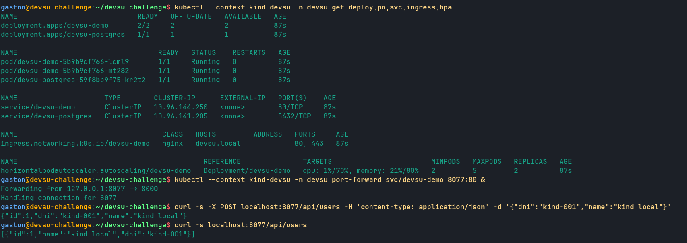

# Procedimiento 3: Kubernetes local con kind

Con la app y la imagen resueltas ([Procedimiento 1 app y contenedor](Procedimiento-1-app-y-contenedor.md)) y el CI dándonos imágenes confiables ([Procedimiento 2 ci](Procedimiento-2-ci.md)), la siguiente etapa de la bitácora fue llevar eso a Kubernetes. Pero antes de tocar la nube armamos todo el stack en un clúster local con [kind](https://kind.sigs.k8s.io/) (Kubernetes en Docker), y vale explicar por qué dimos ese rodeo en lugar de ir directo a AKS.

La razón es de costo y de velocidad de iteración. Cada vuelta contra AKS implica esperar al cloud provider, gastar cuota de la suscripción de prueba y, peor, mezclar dos clases de problemas: los del diseño de los manifiestos (un probe mal apuntado, un securityContext que no arranca, una NetworkPolicy mal escrita) y los de la nube en sí (restricciones del trial, IP pública, Azure CNI). kind nos deja aislar la primera clase: un clúster que se crea en segundos, donde podemos romper, borrar y reconstruir sin consecuencias. La idea fue que para cuando subiéramos a AKS, los manifiestos ya estuvieran depurados y el único trabajo nuevo fuese el de la nube. En la práctica funcionó casi así, con una excepción importante (la NetworkPolicy, que kind no aplica de verdad y AKS sí; lo contamos al final y en detalle en [Arquitectura cloud](Arquitectura-cloud.md)).

## La base con Kustomize

Toda la definición de Kubernetes está organizada como una base de Kustomize más overlays por entorno. La idea es que la base describa la postura productiva (lo que no cambia entre entornos) y cada overlay parchee lo justo y necesario para su contexto. La base vive en [k8s/base](https://github.com/gcamargot/devsu-challenge/tree/master/k8s/base) y su [kustomization.yaml](https://github.com/gcamargot/devsu-challenge/blob/master/k8s/base/kustomization.yaml) fija el namespace `devsu` y lista los recursos. Vale recorrer qué hay y por qué, porque cada pieza responde a un requisito concreto.

El [Deployment](https://github.com/gcamargot/devsu-challenge/blob/master/k8s/base/deployment.yaml) corre con `replicas: 2` (queremos tolerar la caída de un pod sin downtime) y estrategia RollingUpdate con `maxUnavailable: 0`, así un deploy nunca baja la cantidad de réplicas servidas por debajo de las dos. Tiene las tres probes que la app expone gracias al laburo de la etapa 1: una `startupProbe` contra `/health` que le da margen al arranque (hasta 30 intentos cada 2s), una `livenessProbe` también contra `/health` que reinicia el pod si se cuelga, y una `readinessProbe` contra `/ready`, que es la que chequea la base de datos y saca al pod de balanceo si la DB no responde sin necesidad de matarlo.

El securityContext está endurecido a propósito, porque es un servicio público y conviene que un pod comprometido tenga el menor margen posible. A nivel pod corre como `runAsNonRoot` con UID 1000 y `seccompProfile: RuntimeDefault`; a nivel contenedor lleva `allowPrivilegeEscalation: false`, `readOnlyRootFilesystem: true` (con un `emptyDir` montado en `/tmp` para lo poco que necesita escribir) y `drop: [ALL]` de capabilities. Esto no es decorativo: más adelante Kyverno va a rechazar cualquier pod que no cumpla justo estas condiciones ([Operacion](Operacion.md)), así que la base ya nace conforme a la policy.

El resto de los recursos completa la postura:

- **Service** ClusterIP, porque la app nunca se expone directo, siempre detrás del ingress.
- **[HPA](https://github.com/gcamargot/devsu-challenge/blob/master/k8s/base/hpa.yaml)** en `autoscaling/v2`, que escala de 2 a 5 réplicas mirando CPU al 70% y memoria al 80%. El mínimo en 2 mantiene la alta disponibilidad incluso sin carga.
- **PDB** con `minAvailable: 1`, para que un drain de nodo o un mantenimiento no se lleve puestas las dos réplicas a la vez.
- **Ingress**, que en la base queda genérico y cada overlay parchea con su host y su TLS.
- **[NetworkPolicy](https://github.com/gcamargot/devsu-challenge/blob/master/k8s/base/networkpolicy.yaml)** que solo deja entrar al pod de la app desde el namespace `ingress-nginx` (default-deny implícito para todo lo demás).
- **ConfigMap** con la configuración no sensible (PORT, NODE_ENV, dialect, datos de conexión menos el password). El `DB_HOST` queda apuntando al postgres in-cluster por default y se sobreescribe en el overlay que lo necesite.
- **ServiceAccount** con `automountServiceAccountToken: false`, porque la app nunca le habla a la API de Kubernetes y no tiene sentido dejarle un token montado que alguien pueda abusar.

El detalle de cada manifiesto y el reparto base/overlays está en [Estructura del repositorio](Estructura-del-repositorio.md); acá nos quedamos con el para qué.

## El overlay local-kind

El overlay de kind ([k8s/overlays/local-kind](https://github.com/gcamargot/devsu-challenge/tree/master/k8s/overlays/local-kind)) toma esa base y le suma las piezas que solo tienen sentido en local. Su [kustomization.yaml](https://github.com/gcamargot/devsu-challenge/blob/master/k8s/overlays/local-kind/kustomization.yaml) hace cuatro cosas:

1. **Postgres in-cluster.** Como en local no hay una base administrada, agregamos un [postgres.yaml](https://github.com/gcamargot/devsu-challenge/blob/master/k8s/overlays/local-kind/postgres.yaml) con un Deployment de `postgres:16-alpine` (una réplica, `emptyDir` como almacenamiento porque es descartable), su Service y una NetworkPolicy que habilita el tramo app->postgres en el puerto 5432. Es deliberadamente efímero: si se borra el clúster, se borra la base, y está bien que así sea.
2. **Secret demo.** Un `secretGenerator` arma el `devsu-demo-secret` con credenciales de juguete válidas solo para este stack local (sin valor real, no se documentan acá). En AKS este Secret no se genera así: lo provee Key Vault vía el driver CSI ([Arquitectura cloud](Arquitectura-cloud.md)).
3. **Issuer self-signed.** Como a un clúster local no lo puede alcanzar Let's Encrypt, el [issuer-selfsigned.yaml](https://github.com/gcamargot/devsu-challenge/blob/master/k8s/overlays/local-kind/issuer-selfsigned.yaml) define un ClusterIssuer self-signed. No nos da un certificado de verdad, pero ejercita todo el cableado de cert-manager más el ingress TLS, que es lo que queremos validar antes de la nube. El [patch-ingress.yaml](https://github.com/gcamargot/devsu-challenge/blob/master/k8s/overlays/local-kind/patch-ingress.yaml) apunta el ingress al host `devsu.local` con TLS contra ese issuer.
4. **Imagen local.** El overlay reescribe la imagen de `ghcr.io/gcamargot/devsu-challenge` a `devsu-demo:local`, que es la que cargamos en kind a mano, y el [patch-deployment.yaml](https://github.com/gcamargot/devsu-challenge/blob/master/k8s/overlays/local-kind/patch-deployment.yaml) pone `imagePullPolicy: IfNotPresent` para que el kubelet use esa imagen ya cargada en vez de intentar bajarla de un registry (que en local no existe).

## Add-ons del clúster

Un kind recién creado es un Kubernetes pelado: no trae controller de ingress, ni cert-manager, ni servidor de métricas. Antes de aplicar el overlay instalamos tres add-ons, los mismos que después corren en AKS (ahí los instala [scripts/bootstrap-addons.sh](https://github.com/gcamargot/devsu-challenge/blob/master/scripts/bootstrap-addons.sh)):

- **ingress-nginx**, el controller que materializa los Ingress y nos da el punto de entrada HTTP/HTTPS al clúster.
- **cert-manager**, que observa el Ingress y, vía el ClusterIssuer self-signed, emite y rota el certificado TLS que termina en el secret `devsu-demo-tls`.
- **metrics-server**, sin el cual el HPA no tiene de dónde leer el uso de CPU y memoria, y se queda en `<unknown>` sin escalar nunca. Es un add-on fácil de olvidar hasta que uno mira el HPA y no entiende por qué no reporta métricas.

> **Tip:** si el HPA muestra los targets en `<unknown>` y no escala nunca, lo primero a revisar es metrics-server. Un kind (o cualquier cluster pelado) no lo trae, y sin él el autoscaler queda ciego aunque los manifiestos estén perfectos.

## El bug del namespace

Acá nos comimos un problema que vale documentar, porque es el tipo de cosa que en local cuesta diez minutos y en producción te arruina un deploy. La primera versión del overlay no fijaba el namespace para sus propios recursos. La base sí lo fijaba (`namespace: devsu`), pero el overlay agregaba el postgres y el secret sin volver a declararlo, así que esos dos terminaban en el namespace `default`.

El síntoma fue desconcertante al principio: los pods de la app quedaban en `CreateContainerConfigError`. Mirando de cerca, el `envFrom` del Deployment apuntaba al `devsu-demo-secret` dentro del namespace `devsu` (donde sí vivía la app), pero el Secret se había creado en `default`. Como un Secret no cruza namespaces, el kubelet no podía resolver las variables de entorno y no llegaba a construir el contenedor. Lo mismo pasaba con postgres: el Service `devsu-postgres` quedaba en `default` y la app, en `devsu`, no lo resolvía por DNS.

El arreglo fue de una línea: declarar `namespace: devsu` también en el `kustomization.yaml` del overlay, con lo cual sus recursos propios caen en el mismo namespace que la base. Quedó comentado ahí mismo ("also scope the overlay's own resources to the app namespace") para que no se repita. La lección que nos llevamos es que en Kustomize el `namespace` de la base no se hereda automáticamente a los recursos que el overlay agrega por su cuenta, y que un `CreateContainerConfigError` casi siempre apunta a un ConfigMap o Secret que el pod no encuentra (mal nombre o mal namespace), no a un problema de la imagen.

> **Gotcha:** en Kustomize el `namespace` de la base no se hereda a los recursos que el overlay agrega por su cuenta. El postgres y el secret terminaban en `default` mientras la app vivía en `devsu`, y como un Secret no cruza namespaces, los pods quedaban en `CreateContainerConfigError`. Regla práctica: un `CreateContainerConfigError` casi siempre es un ConfigMap o Secret mal resuelto (nombre o namespace), no la imagen.

## Flujo a dev

El ciclo de trabajo en local quedó en cuatro pasos: construir la imagen, cargarla en el clúster kind, aplicar el overlay con `kubectl apply -k` y verificar.

El `kind load docker-image` es el equivalente local de un push a un registry: mete la imagen recién construida en el nodo de kind, y por eso el overlay pone `imagePullPolicy: IfNotPresent`, para que el kubelet la encuentre ahí en vez de salir a buscarla afuera.

## Qué verificamos

Una vez aplicado el overlay, comprobamos tres cosas, que son las que nos dan confianza de que el diseño funciona antes de subirlo:

- **Las 2 réplicas Ready.** Un `kubectl get all -n devsu` tiene que mostrar el Deployment con `2/2` y los dos pods en `Running` y `Ready`. Que estén Ready (no solo Running) confirma que la `readinessProbe` contra `/ready` pasa, lo que a su vez confirma que la app está hablando con postgres.
- **El HPA con métricas reales.** `kubectl get hpa -n devsu` tiene que mostrar los targets con valores concretos (algo como `cpu: 3%/70%`, `memory: 40%/80%`) y no `<unknown>`. Si aparece `<unknown>` es que metrics-server no está instalado o todavía no juntó datos, y el autoscaler estaría ciego.
- **CRUD por HTTPS contra el postgres compartido.** Con `curl` sobre el ingress (host `devsu.local`, en HTTPS aceptando el cert self-signed con `-k`) creamos un usuario, lo listamos y lo borramos. Que el dato persista entre requests prueba el camino completo: ingress -> Service -> app -> postgres, y que las dos réplicas comparten la misma base (un POST que entra por una réplica se ve en un GET que cae en la otra).

Con eso depurado, el salto a AKS dejó de ser un experimento y pasó a ser, en su mayor parte, trabajo de nube: la IP pública, el registry, Key Vault y la sorpresa de la NetworkPolicy que kind no aplicaba y Azure CNI sí. Todo eso está contado en [Arquitectura cloud](Arquitectura-cloud.md) y en [Operacion](Operacion.md).

> **Gotcha:** kind usa kindnet, que declara las NetworkPolicies pero no las aplica: en local todo el tráfico fluye igual sin importar la política. En AKS con Azure CNI las políticas se aplican en serio, así que una NetworkPolicy que en kind parecía inofensiva (el default-deny) puede cortar tráfico recién en la nube. Es el caso de libro de "está declarado" vs "está aplicado"; el detalle del corte app -> postgres está en [Arquitectura cloud](Arquitectura-cloud.md).

## Evidencia

Esta es la verificación real del stack corriendo en el cluster kind local.

La captura junta todo: el `kubectl get` muestra el Deployment `devsu-demo` en `2/2`, el postgres in-cluster, el ingress y el HPA reportando métricas reales de CPU y memoria (no `<unknown>`); y por debajo, un CRUD por port-forward donde un POST crea un usuario y un GET lo devuelve. La señal clave es doble: que el HPA tenga números concretos significa que metrics-server está alimentando al autoscaler, y que el GET recupere el usuario que creó el POST prueba que las dos réplicas comparten estado a través del postgres (el dato persiste cruzando réplicas, no vive en la memoria de un pod). Es el mismo stack de producción corriendo en local con 2 réplicas, HPA y estado compartido. Se reproduce con `kubectl get all,hpa -n devsu` y un `kubectl port-forward` contra el Service seguido de los `curl` de POST y GET sobre `/api/users`.
