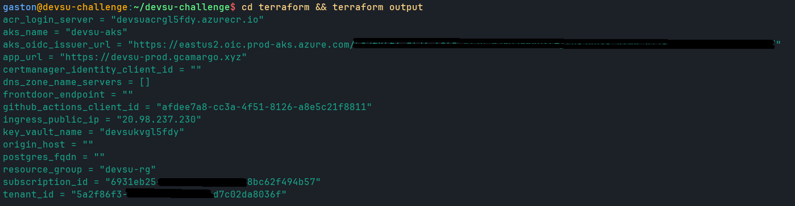
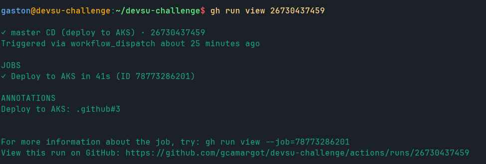
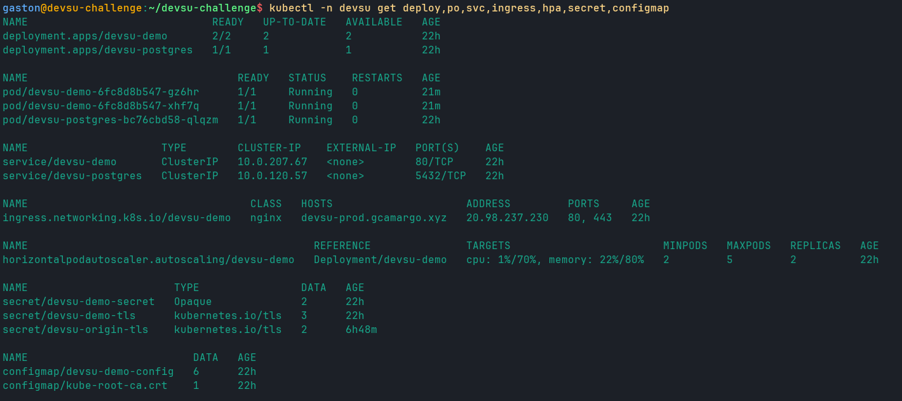
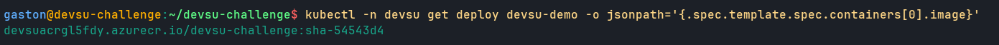
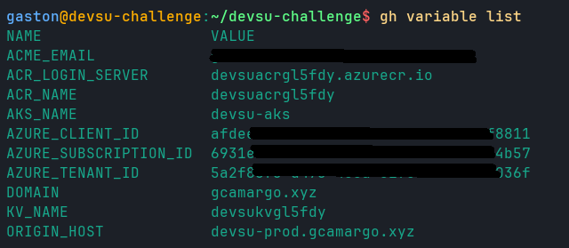
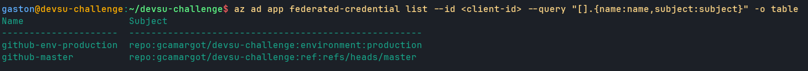

# Procedimiento 4: la infraestructura en Azure

Con la app empaquetada (lo vimos en [Procedimiento 1 app y contenedor](Procedimiento-1-app-y-contenedor.md)) y el CI publicando imágenes a GHCR ([Procedimiento 2 ci](Procedimiento-2-ci.md)), la etapa siguiente de la bitácora es bajar todo eso a una nube de verdad. Acá la historia deja de ser solo "qué decidimos" y pasa a ser "qué nos dejó hacer la suscripción", porque esta es una cuenta de prueba (trial) y casi cada paso chocó con una restricción que no esperábamos. Lo interesante es que ninguna de esas restricciones nos obligó a tirar abajo el diseño productivo: cada obstáculo se resolvió con un flag o un cambio chico, dejando el camino productivo escrito y apagado para cuando se corra en una cuenta sin esos límites.

El principio que mantuvimos todo el tiempo fue ese: la infra se describe entera en Terraform (carpeta [terraform/](https://github.com/gcamargot/devsu-challenge/tree/master/terraform)), las piezas que el trial no permite quedan detrás de un `count` condicionado por una variable, y el default de esa variable es el que funciona en la cuenta real. Así el repo cuenta la verdad de las dos realidades a la vez: la que está corriendo y la que correría en producción.

> **Atencion:** esta es una suscripción de prueba y casi cada pieza chocó con un candado del trial: la región `eastus` bloqueada, la serie B de VMs no habilitada para AKS, PostgreSQL Flexible con la oferta restringida en la región y Front Door directamente prohibido. Ninguna de estas restricciones aplica en una cuenta sin esos límites; todas quedan resueltas con un flag o una variable cuyo default apunta al camino productivo.

## Lo que se levanta de una pasada

El núcleo de la infra vive en [main.tf](https://github.com/gcamargot/devsu-challenge/blob/master/terraform/main.tf) y es lo que sí pudimos crear sin pelea: el Resource Group `devsu-rg`, un Azure Container Registry (SKU Basic, `admin_enabled = false`, sin usuario admin), el cluster AKS `devsu-aks` con el control plane en SKU Free, y un role assignment `AcrPull` que le da a la kubelet identity del cluster permiso para bajar imágenes del ACR sin `imagePullSecrets`. Los nombres globalmente únicos (ACR, Key Vault) llevan un sufijo random de 6 caracteres, que es de dónde salen `devsuacrgl5fdy` y `devsukvgl5fdy`.

El AKS arranca con dos cosas prendidas que importan más adelante: `oidc_issuer_enabled` con `workload_identity_enabled`, que es lo que habilita la federación de identidades (la usa cert-manager y, fuera del cluster, GitHub Actions), y el addon `key_vault_secrets_provider` con rotación, que es el driver CSI que sincroniza el secret de la base desde Key Vault. El password de esa base no está en git ni en un Secret plano: lo guarda [keyvault.tf](https://github.com/gcamargot/devsu-challenge/blob/master/terraform/keyvault.tf) en el Key Vault (con RBAC, no access policies) y la identidad del CSI driver lo lee en runtime con el rol `Key Vault Secrets User`.

A partir de acá empieza la saga.

## Restricción 1: eastus no nos dejaba, pasamos a eastus2

La primera elección de región fue `eastus`, que es el default histórico y el más cercano. La suscripción de prueba nos lo bloqueó por partida doble: la SKU de VM que queríamos no estaba habilitada ahí y la oferta de PostgreSQL administrado estaba restringida en esa locación. Antes de pelear con cada cosa por separado, lo más limpio fue mover toda la infra a `eastus2`, que en esta cuenta venía con menos candados. El cambio es de una línea, porque la región es la variable `location` en [variables.tf](https://github.com/gcamargot/devsu-challenge/blob/master/terraform/variables.tf) (el default en el repo sigue siendo `eastus`, y en `eastus2` se sobreescribe por tfvars). Todo lo demás (RG, ACR, AKS, Key Vault) toma su `location` de la del Resource Group, así que mover la región fue cambiar un solo valor y dejar que el resto lo herede.

Mover de región nos sacó un problema de encima pero no todos: eastus2 trajo los suyos.

## Restricción 2: la serie B no está habilitada para AKS, fuimos a D2s_v3

Para el node pool la primera idea fue una `Standard_B2s`. Para una API liviana sobra, son máquinas con burst de CPU baratas, ideales para mantener el trial económico. La cuenta no habilita la serie B para nodos de AKS en esta locación, así que el node pool quedó en `Standard_D2s_v3`. Igual que con la región, esto es una variable (`node_vm_size` en [variables.tf](https://github.com/gcamargot/devsu-challenge/blob/master/terraform/variables.tf)), no un valor hardcodeado en el recurso del cluster: si mañana se habilita la serie B, se cambia el default y listo. El SKU del control plane no se tocó, sigue en Free.

## Restricción 3: PostgreSQL administrado offer-restricted, postgres in-cluster como fallback

El diseño productivo de la base es Azure Database for PostgreSQL Flexible Server, y está escrito completo en [postgres.tf](https://github.com/gcamargot/devsu-challenge/blob/master/terraform/postgres.tf): el server, la database `devsu`, la firewall rule para que los servicios de Azure (incluido el egress de AKS) lleguen, y un `random_password` que viaja directo a Key Vault. Al intentar crearlo, Azure devolvió `LocationIsOfferRestricted`: la oferta de PostgreSQL administrado no está disponible para esta suscripción en esta región.

Acá es donde el patrón de "todo detrás de un flag" se gana el sueldo. Todos los recursos de [postgres.tf](https://github.com/gcamargot/devsu-challenge/blob/master/terraform/postgres.tf) tienen `count = var.enable_managed_pg ? 1 : 0`, y la variable `enable_managed_pg` quedó en `false`. Con el flag apagado, Terraform no intenta crear nada de la base administrada y en su lugar corre un PostgreSQL in-cluster (un pod en el namespace de la app, lo despliega el overlay de Kubernetes, no Terraform). La app no se entera de la diferencia: apunta a `DB_HOST` y `DB_PORT` por configuración y le da exactamente igual si del otro lado hay un Flexible Server administrado o un pod de postgres. El día que esto corra en una cuenta sin la restricción, se prende `enable_managed_pg`, el `output "postgres_fqdn"` (que hoy devuelve string vacío) empieza a devolver el FQDN real, y la app apunta ahí sin tocar una línea de código.

Vale aclarar que el `random_password.pg` se genera siempre, prendido o no el flag, porque es el que alimenta el secret `db-password` de Key Vault que consume el postgres in-cluster. La pieza productiva está apagada, pero el manejo del secreto es el mismo en los dos mundos.

## Restricción 4: un nodo no alcanzaba, escalamos a dos

El default de `node_count` en el repo es 1, con un comentario que dice que un nodo mantiene el trial barato y que el HPA igual funciona. La intención era correr la app con un solo nodo. No alcanzó. Apenas instalamos los add-ons del cluster (ingress-nginx, cert-manager y Kyverno) la CPU del único nodo quedó saturada: entre los controllers de borde, el emisor de certificados y el admission controller de políticas no quedaba lugar para los pods de la app. La solución fue escalar a 2 nodos, que es cambiar el valor de `node_count`. No es un parche feo: es la capacidad real que pide el stack que decidimos correr, y dejarlo como variable es lo que nos dejó descubrirlo y ajustarlo sin reescribir nada.

Los add-ons no los pone Terraform sino el script de bootstrap [scripts/bootstrap-addons.sh](https://github.com/gcamargot/devsu-challenge/blob/master/scripts/bootstrap-addons.sh), que se corre una vez por cluster después del `terraform apply`: lee los outputs de Terraform, instala ingress-nginx atado a la IP pública estática, cert-manager con workload identity, metrics-server, Kyverno, y aplica las políticas de [k8s/policies/](https://github.com/gcamargot/devsu-challenge/tree/master/k8s/policies). Esa separación (infra con Terraform, add-ons con Helm vía script) es la que hace evidente, al correrlo, que un nodo no daba.

## Restricción 5: Azure CNI aplica NetworkPolicy de verdad

El cluster usa Azure CNI con `network_policy = azure` (está en el `network_profile` de [main.tf](https://github.com/gcamargot/devsu-challenge/blob/master/terraform/main.tf)), y elegir eso a conciencia nos ahorró una sorpresa fea en producción, pero nos la hizo vivir en el deploy. En el cluster local con kind, que usa kindnet, las NetworkPolicies están declaradas pero no se aplican: todo el tráfico fluye igual sin importar la política. En AKS, con Azure CNI, las políticas se aplican en serio.

El efecto concreto fue que Kyverno genera una NetworkPolicy `default-deny-ingress` en el namespace de la app (la política `add-default-networkpolicy`, ver más abajo), y con eso solo la app dejó de poder hablar con postgres. En kind no se notaba porque kindnet ignoraba el default-deny; en AKS, el default-deny estaba realmente bloqueando el tramo app -> postgres. Lo resolvimos agregando la NetworkPolicy explícita que habilita ese tramo, que es la postura que queríamos desde el principio (default-deny con allow explícito de lo mínimo). Es el caso de libro de la diferencia entre "está declarado" y "está aplicado", y preferimos que nos pegara en el deploy a una cuenta de prueba antes que en producción.

> **Gotcha:** Azure CNI con `network_policy = azure` aplica las NetworkPolicies de verdad, a diferencia de kindnet en local. El default-deny que Kyverno genera no se notaba en kind y en AKS cortó el tramo app -> postgres apenas se desplegó. Hizo falta una NetworkPolicy explícita que habilite ese tramo; el default-deny por sí solo bloquea todo lo que no esté permitido a mano.

## Policy-as-code: Kyverno enforced

Sobre el cluster corre Kyverno en modo enforce (`validationFailureAction: Enforce`), no audit. La diferencia es la que importa: en audit un pod que viola una política se admite y solo se registra; en enforce se rechaza en el admission y nunca llega a correr. Las políticas viven en [k8s/policies/](https://github.com/gcamargot/devsu-challenge/tree/master/k8s/policies) y son tres:

- **require-requests-limits** ([require-requests-limits.yaml](https://github.com/gcamargot/devsu-challenge/blob/master/k8s/policies/require-requests-limits.yaml)): todo container tiene que declarar requests y limits de CPU y memoria. Sin esto un pod sin límites puede comerse el nodo, que con dos nodos chicos es justo lo que no queremos.
- **restricted-securitycontext** ([restricted-securitycontext.yaml](https://github.com/gcamargot/devsu-challenge/blob/master/k8s/policies/restricted-securitycontext.yaml)): exige `runAsNonRoot`, `allowPrivilegeEscalation: false`, `readOnlyRootFilesystem: true` y `drop: [ALL]` de capabilities. Es el endurecimiento que la app cumple desde el Dockerfile y el deployment base.
- **add-default-networkpolicy** ([default-networkpolicy.yaml](https://github.com/gcamargot/devsu-challenge/blob/master/k8s/policies/default-networkpolicy.yaml)): es una política de tipo generate, no validate. Cuando aparece un namespace etiquetado como parte de `devsu-demo`, Kyverno le genera automáticamente una NetworkPolicy `default-deny-ingress`. Es la que en combinación con Azure CNI nos cortó el tramo a postgres, y la razón por la que ese default-deny existe siempre sin que nadie tenga que acordarse de crearlo.

El postgres in-cluster es la excepción declarada: necesita un rootfs escribible para sus datos, así que está excluido de la política de securityContext (por el `matchLabels` de `app.kubernetes.io/name: devsu-postgres`). No queda fuera de todo, igual cae bajo require-requests-limits. Es la única concesión, y está escrita y justificada en la propia política para que no parezca un agujero olvidado.

## El CD a AKS por OIDC

El despliegue lo hace el workflow [.github/workflows/cd.yml](https://github.com/gcamargot/devsu-challenge/blob/master/.github/workflows/cd.yml), y la decisión de fondo es que no hay ningún secreto de Azure guardado en GitHub. La autenticación es por OIDC: Terraform crea en [identity.tf](https://github.com/gcamargot/devsu-challenge/blob/master/terraform/identity.tf) una app registration (`azuread_application`) con dos federated credentials, `github-master` atada al subject `repo:gcamargot/devsu-challenge:ref:refs/heads/master` y `github-env-production` atada al subject `repo:gcamargot/devsu-challenge:environment:production`. Como el job de CD declara `environment: production`, el token OIDC que emite GitHub viene con subject de environment, así que la credencial que matchea para este deploy es `github-env-production` (la de rama queda disponible por si un job sin environment necesitara federar contra `master`). A esa identidad Terraform le asigna los roles que habilitan el CD: `Contributor` y `AcrPush` sobre el ACR (el primero para operar el registry, el segundo para que `az acr import` y el `cosign copy`/push de la firma puedan escribir), y `Azure Kubernetes Service Cluster Admin Role` sobre el cluster (para el `az aks get-credentials --admin`). Cuando el job corre, GitHub emite un token OIDC, Azure lo valida contra la federated credential y devuelve credenciales temporales. No hay password que rotar ni secret que se pueda filtrar.

> **Verificado:** el CD se autentica a Azure por OIDC, sin ningún secret de Azure en GitHub: las credenciales son temporales y se emiten por corrida, así que no hay password que rotar ni que se pueda filtrar. El subject del token es `repo:gcamargot/devsu-challenge:environment:production` (no la rama) porque el job declara `environment: production`; la app registration tiene las dos federated credentials, `github-master` (subject de rama) y `github-env-production` (subject de environment), y la que aplica acá es la de environment.

Con la sesión ya autenticada, y con `kubectl` instalado en el runner por `azure/setup-kubectl@v4`, el CD hace lo siguiente en orden:

1. **`az acr import`**: la imagen ya está pública en GHCR (la dejó ahí el CI). En vez de reconstruirla, el CD la copia tal cual a ACR con `az acr import --force`. Esto es deliberado: la imagen que se deploya es bit a bit la misma que el CI escaneó con Trivy, no una recompilada. Y al quedar en ACR, AKS la baja por el rol AcrPull sin necesitar credenciales de GHCR adentro del cluster.
2. **`cosign copy`**: trae la firma y las attestations de la imagen desde GHCR a ACR. `az acr import` copia solo el manifest de la imagen, no los artefactos de firma que cuelgan de ella, así que sin este paso Kyverno no podría verificar la firma en el cluster. Con la firma ya en ACR, la verificación corre contra el mismo registry del que AKS baja la imagen.
3. **`az aks get-credentials --admin`**: trae el kubeconfig del cluster usando la identidad federada.
4. **`kubectl apply -k k8s/overlays/aks-live`**: aplica el overlay de Kustomize ([k8s/overlays/aks-live](https://github.com/gcamargot/devsu-challenge/tree/master/k8s/overlays/aks-live)), que es la topología real del trial (imagen desde ACR, PostgreSQL in-cluster, ingress con certificado Cloudflare Origin CA en el secret `devsu-origin-tls`). El render previo es mínimo: un `sed` sobre `kustomization.yaml` que reemplaza el único placeholder `__ACR_LOGIN_SERVER__` y fija la imagen al `ACR/devsu-challenge:sha-<commit>`. Cierra esperando el rollout con `kubectl rollout status`, así un deploy que no estabiliza se marca como fallido en vez de quedar verde por error.

El overlay `aks` ([k8s/overlays/aks](https://github.com/gcamargot/devsu-challenge/tree/master/k8s/overlays/aks)) queda como la variante productiva (PostgreSQL administrado, secret de la base vía Key Vault CSI, TLS por Let's Encrypt con cert-manager) y es el que arrastra el juego completo de placeholders `__UPPER__` (FQDN de postgres, dominio, datos de Key Vault, email de ACME, etc.); se aplicaría el día que el dominio corra en Azure DNS en vez de Cloudflare.

El tag de imagen sale por sha del commit (o branch o semver, según el trigger), que es lo que hace que un deploy apunte siempre a una versión exacta y reproducible. Los valores de `vars.*` que usa el workflow (client id, tenant, subscription, nombres de RG/ACR/AKS) se cargan una sola vez desde `terraform output` después de levantar la infra.

> **Verificado:** el CD corre verde de punta a punta: login OIDC, `az acr import`, `cosign copy`, `az aks get-credentials --admin`, `kubectl apply -k k8s/overlays/aks-live` y el `rollout status` esperando que `deploy/devsu-demo` estabilice. Hay runs reales en Actions, no es solo un diseño en papel.

## Diagrama: flujo a producción

El detalle de cómo el tráfico entra a este cluster desde afuera (Cloudflare, DNS, TLS) está en [Arquitectura](Arquitectura-cloud.md); acá nos quedamos en el camino del artefacto hasta que corre en AKS.

## Evidencia

La salida de `terraform output` lista los recursos que levanta la IaC (ACR, AKS, Key Vault, IP pública del ingress, client id de GitHub Actions). Significa que toda la infra se describe en Terraform y expone sus identificadores como outputs, que después alimentan la config del CD. Se reproduce con `terraform output` desde la carpeta `terraform/`.

El run del CD a AKS sale verde en todos sus pasos (login OIDC, `az acr import`, `cosign copy`, `az aks get-credentials` y `kubectl apply -k aks-live` con `rollout status`). Significa que el despliegue a Kubernetes está integrado en el pipeline y corre de verdad, no es solo un diseño en papel. Se reproduce con `gh run view <run-id> --repo gcamargot/devsu-challenge`.

`kubectl get` en el namespace `devsu` muestra el Deployment `devsu-demo` en 2/2, el postgres in-cluster, el Service, el Ingress (`devsu-prod.gcamargo.xyz`), el HPA (min 2, max 5) y los secrets. Significa que la app corre en su forma productiva: dos réplicas detrás del HPA, con su ConfigMap, Secret e Ingress. Se reproduce con `kubectl get all,ingress,hpa,secret -n devsu`.

La imagen del Deployment es `devsuacrgl5fdy.azurecr.io/devsu-challenge:sha-<commit>`. Significa que AKS baja la imagen del ACR (vía el rol AcrPull de la kubelet identity, sin imagePullSecrets) y es exactamente la imagen firmada que verificó cosign, no una recompilada. Se reproduce con `kubectl get deploy devsu-demo -n devsu -o jsonpath='{.spec.template.spec.containers[0].image}'`.

`gh variable list` muestra las variables que consume el CD (ids no sensibles y nombres de recursos). Significa que esa config vive como Variables del environment `production`, no como secretos (no abren nada por sí solas), y se cargaron desde `terraform output`. Se reproduce con `gh variable list --env production --repo gcamargot/devsu-challenge`.

El listado de federated credentials muestra dos entradas: `github-master` (subject `...:ref:refs/heads/master`) y `github-env-production` (subject `...:environment:production`). Significa que la confianza OIDC de GitHub hacia Azure es sin client secret; como el job de CD declara `environment: production`, el token que presenta matchea la credencial de environment. Se reproduce con `az ad app federated-credential list --id <app-id>`.
