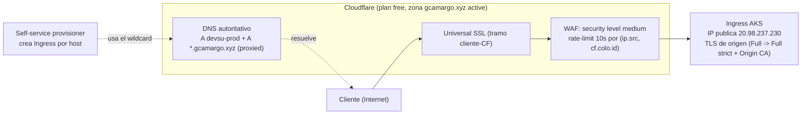

# Procedimiento 5: Borde y DNS con Cloudflare

Con el clúster levantado en AKS y la app sirviendo detrás del ingress ([Arquitectura cloud](Arquitectura-cloud.md)), nos quedaba resolver la última etapa de la bitácora antes de poder hablar de un host público de verdad: el borde. Y acá conviene recordar el contexto que arrastra todas las decisiones, porque es lo que justifica el énfasis. Users API es un servicio HTTP público y sin autenticación (cualquiera que conozca la URL le puede pegar a `/api/users`). No hay una capa de login que filtre tráfico más adentro, así que todo lo que en otro producto resolvería esa capa (ocultar el origen, frenar abuso, absorber picos y ataques volumétricos) lo tenemos que poner en el borde. Por eso el borde no es un lujo en este diseño, es la pieza que sostiene la postura de seguridad.

## Por qué terminamos en Cloudflare

La primera idea fue la natural estando todo en Azure: resolver el borde con Azure Front Door y su WAF. Lo escribimos en Terraform, lo intentamos crear y la suscripción lo rechazó de plano con el mensaje `Free Trial and Student account is forbidden for Azure Frontdoor resources`. Las cuentas de prueba simplemente no tienen habilitado Front Door, y no hay flag que lo destrabe del lado nuestro. Fue una más de la saga de restricciones del trial que nos veníamos comiendo (la serie B de VMs bloqueada para AKS, PostgreSQL Flexible con la oferta restringida en la región), solo que esta pegaba justo en la pieza que más nos importaba.

> <font color="#cf222e">**Gotcha:**</font> Azure Front Door está prohibido en cuentas de prueba (`Free Trial and Student account is forbidden for Azure Frontdoor resources`) y no hay flag del lado nuestro que lo destrabe. La definición quedó escrita en Terraform detrás de `enable_frontdoor` (apagado) para volver a ella en una cuenta sin esa restricción; el borde que efectivamente corre es Cloudflare.

Como el requisito de fondo seguía en pie (un servicio público y sin auth necesita un borde que oculte el origen y filtre tráfico), buscamos un equivalente que el trial no nos prohibiera y caímos en Cloudflare. Su plan gratuito cubre exactamente lo que necesitábamos sin costo: proxy con CDN, protección DDoS siempre activa, TLS de edge con Universal SSL y un WAF básico (el managed ruleset gratuito más unas pocas reglas propias y un rate-limit). No es Front Door, pero para este caso el plan free alcanza y sobra.

La pieza de Front Door no la tiramos. Quedó escrita en Terraform pero detrás de un flag apagado (`enable_frontdoor`, que por la cadena de locals depende a su vez de tener una zona DNS de Azure y de `enable_azure_dns`), de modo que en una cuenta sin esa restricción se puede volver a Front Door prendiendo el flag, sin reescribir nada. Esa definición gated vive en [frontdoor.tf](https://github.com/gcamargot/devsu-challenge/blob/master/terraform/frontdoor.tf), y los recursos de Cloudflare que efectivamente usamos están en [cloudflare.tf](https://github.com/gcamargot/devsu-challenge/blob/master/terraform/cloudflare.tf).

## Mover la autoridad de DNS a Cloudflare

El proxy gratuito de Cloudflare arrastra una condición que no es obvia hasta que uno la lee: para que el tráfico pase por el borde, Cloudflare tiene que ser además la autoridad de DNS de la zona. No alcanza con apuntar un CNAME desde otro proveedor; la "nube naranja" (el modo proxied) solo existe si los name servers de la zona son los de Cloudflare.

El dominio `gcamargo.xyz` estaba registrado en GoDaddy, así que el paso fue reapuntar los name servers: dar de alta la zona en Cloudflare, esperar a que nos asigne su par de NS y cambiar los NS en GoDaddy por esos. El registro del dominio sigue en GoDaddy (eso no cambia), lo que se movió es solo la autoridad de resolución. Una vez propagado, la zona pasa a estado `active` en el panel de Cloudflare, que es la señal de que ya está sirviendo el DNS y de que los records proxied tienen efecto.

## Los records proxied

Sobre esa zona definimos dos records `A`, los dos en modo proxied y apuntando a la misma IP, la pública estática del ingress de AKS (`20.98.237.230`):

- Un `A` para `devsu-prod` (es decir `devsu-prod.gcamargo.xyz`), que es el host público de la app.
- Un `A` wildcard para `*.gcamargo.xyz`.

Los dos van proxied a propósito. Estar proxied es lo que mete el tráfico por el borde (CDN, WAF, rate-limit, DDoS) en vez de resolver directo a la IP del clúster; un record en modo "DNS only" (nube gris) devolvería la IP de Azure al cliente y se saltearía todo el borde, que es justo lo que no queremos en un servicio sin auth. Un detalle de Terraform que se ve en [cloudflare.tf](https://github.com/gcamargot/devsu-challenge/blob/master/terraform/cloudflare.tf): mientras un record está proxied, el TTL tiene que ser automático (`ttl = 1`), porque el TTL real lo maneja Cloudflare en el borde.

> <font color="#9a6700">**Atencion:**</font> un record en modo "DNS only" (nube gris) publica la IP de Azure al cliente y se saltea el borde entero (WAF, rate-limit, DDoS). En un servicio sin auth eso es exactamente lo que no queremos, así que los dos records van proxied. Ojo además con el TTL: mientras un record está proxied tiene que quedar en automático (`ttl = 1`), o Terraform falla.

El wildcard no es decorativo, y vale explicar por qué está. El [Self service provisioner](Self-service-provisioner.md) levanta entornos efímeros, y cada uno necesita su propio subdominio (`<subdomain>.gcamargo.xyz`, con `devsu-prod` como default pero customizable por el usuario del form). Si tuviéramos que crear un record DNS por cada entorno que se provisiona, el provisioner tendría que tener permisos sobre la zona de Cloudflare y manejar la creación y el borrado de records, con todo el lío que eso implica. El wildcard resuelve eso de una: cualquier subdominio que el provisioner invente resuelve a la misma IP del ingress, y el ruteo fino lo hace el Ingress de Kubernetes por host. El provisioner solo crea el Ingress con el host elegido y listo, sin tocar DNS.

## TLS de edge: Universal SSL y el plan a Full strict

El esquema de TLS tiene dos tramos independientes, cada uno con su certificado, y conviene no confundirlos.

El primer tramo es cliente-Cloudflare. Lo cubre Universal SSL, que Cloudflare emite y renueva solo, sin que tengamos que hacer nada (cubre `gcamargo.xyz` y `*.gcamargo.xyz`). El cliente siempre ve un certificado válido emitido por la CA de Cloudflare, y la terminación TLS de cara a Internet pasa en el borde.

El segundo tramo es Cloudflare-origen (el ingress de AKS). Hoy el modo SSL de la zona está en **Full**, que cifra ese segundo tramo pero no valida el certificado del origen (Cloudflare se conforma con que el origen hable HTTPS, aunque el cert sea self-signed o no coincida). Es funcional pero deja una puerta: en teoría alguien en el medio del tramo Cloudflare-origen podría presentar otro certificado y Cloudflare no se daría cuenta. El plan, documentado para cuando lo cerremos, es endurecerlo a **Full (strict)**, instalando en el ingress un certificado **Cloudflare Origin CA** (wildcard, gratuito, válido únicamente para el tramo Cloudflare-origen) como secret TLS. Con eso Cloudflare valida que el origen presenta ese cert y rechaza cualquier otra cosa, incluido un origen en claro. Si en algún momento se prefiriera una CA pública en el origen en vez del Origin CA, la alternativa sería Let's Encrypt vía cert-manager resolviendo el desafío DNS-01 contra la API de Cloudflare.

## WAF y rate-limit en el plan free

El plan free de Cloudflare no nos da el WAF gestionado completo ni reglas sofisticadas, pero alcanza para una postura razonable en un servicio sin auth. Dejamos el **security level en medium** (Cloudflare desafía con un challenge a las IPs con peor reputación según su scoring, sin molestar al tráfico legítimo) y montamos una **regla de rate-limit** propia, que es la pieza que más nos interesa porque `/api/users` es un endpoint público que invita al scraping y al abuso.

La regla de rate-limit está acotada por lo que el plan free permite: el período de muestreo más corto que ofrece es de **10 segundos**, y la cuenta de requests se agrupa por la combinación de `ip.src` (la IP de origen del cliente) y `cf.colo.id` (el datacenter de Cloudflare que atendió el request). Agrupar también por colo es lo correcto en una red anycast como la de Cloudflare: un mismo cliente puede caer en distintos datacenters y el contador se lleva por (IP, colo), que es donde Cloudflare puede contar de forma consistente. Cuando una IP supera el umbral en esa ventana de 10s, Cloudflare la bloquea por un rato en el borde, antes de que el request toque siquiera la IP de Azure.

## Diagrama




## Hardening del origen: cerrar el origen al borde (aplicado)

Todo lo anterior pierde sentido si alguien puede saltarse el borde pegándole directo a `20.98.237.230`. Mientras la IP del ingress acepte tráfico de cualquier origen, un atacante que la descubra (no es difícil, hay buscadores de hosts que indexan IPs) puede ignorar Cloudflare por completo y con eso el WAF, el rate-limit y la protección DDoS dejan de aplicar. Es el agujero clásico de poner un borde delante de un origen público sin cerrar el origen.

El cierre ya está aplicado: el ingress acepta tráfico solo desde los rangos de IP publicados por Cloudflare (la lista oficial que Cloudflare mantiene) vía la annotation `whitelist-source-range` de ingress-nginx, y el Service del ingress-controller quedó en `externalTrafficPolicy: Local` para que llegue la IP real del cliente (sin SNAT del nodo) y el filtro compare contra la dirección de Cloudflare verdadera. Con eso la única forma de llegar a la app es atravesando el borde. La IaC del parche está en [k8s/overlays/aks-live/patch-ingress.yaml](https://github.com/gcamargot/devsu-challenge/blob/master/k8s/overlays/aks-live/patch-ingress.yaml) y en [scripts/bootstrap-addons.sh](https://github.com/gcamargot/devsu-challenge/blob/master/scripts/bootstrap-addons.sh), con la justificación del `externalTrafficPolicy: Local` documentada en [k8s/overlays/aks-live/svc-externaltrafficpolicy.md](https://github.com/gcamargot/devsu-challenge/blob/master/k8s/overlays/aks-live/svc-externaltrafficpolicy.md). Va de la mano del salto a Full strict del tramo de origen.

> <font color="#1a7f37">**Verificado:**</font> pegarle directo a la IP del ingress (`20.98.237.230`) devuelve **403**; entrar por el dominio devuelve **200** con header `cf-ray` presente. El origen ya solo acepta tráfico que viene de los rangos de Cloudflare, así que el borde dejó de ser saltéable. Esto ya no es un pendiente, está aplicado y verificado.

## Evidencia

> <font color="#0969da">**Evidencia:**</font> espacio para pegar la evidencia del borde (reemplazar por salida real o captura):
>
> - Zona en Cloudflare en estado `active` (captura del panel de la zona `gcamargo.xyz`, o salida de la API mostrando `"status": "active"`).
> - Request a través del borde, verificando que pasa por Cloudflare (header `cf-ray` presente en la respuesta):
>   - `curl -sI https://devsu-prod.gcamargo.xyz/`
> - Allowlist de Cloudflare aplicada: directo a la IP da 403, por el dominio da 200.
>   - `curl -sI --resolve devsu-prod.gcamargo.xyz:443:20.98.237.230 https://devsu-prod.gcamargo.xyz/` (pegándole al origen debería dar `403`).
>   - `curl -sI https://devsu-prod.gcamargo.xyz/` (por el borde debería dar `200` con header `cf-ray`).
> - Verificación del certificado de edge (que lo emite Cloudflare y cubre el host):
>   - `echo | openssl s_client -connect devsu-prod.gcamargo.xyz:443 -servername devsu-prod.gcamargo.xyz 2>/dev/null | openssl x509 -noout -issuer -subject -dates`
>
> ```text
> (pegar acá la salida / captura)
> ```
