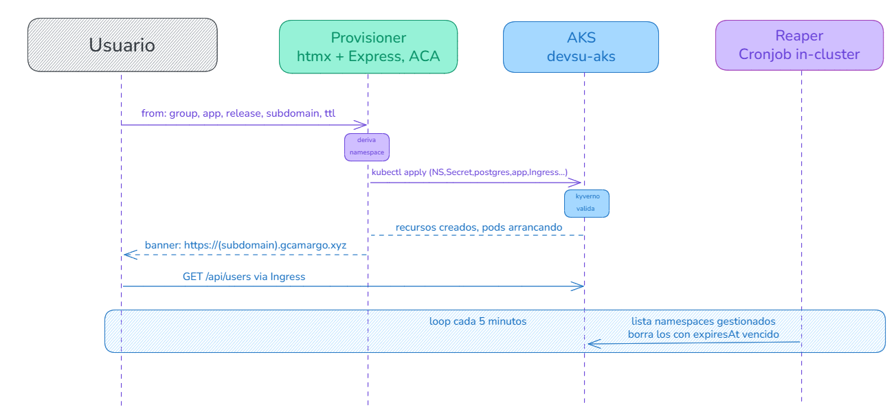
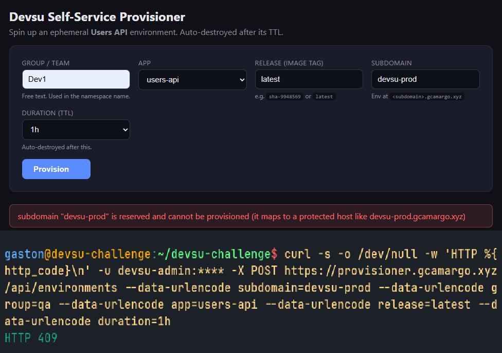

# Procedimiento 6: provisioner self-service

Una vez que el camino productivo estaba en pie (CI/CD, AKS, borde en Cloudflare con su wildcard), nos quedó dando vueltas un problema operativo más mundano: cada vez que alguien quería una demo, probar una rama puntual o validar un release antes de promoverlo, terminábamos haciendo a mano el mismo baile de namespace, manifiestos, ingress y base de datos. Es repetitivo, es propenso a error (un `default` mal puesto, un tag de imagen viejo) y deja entornos colgados que nadie limpia. Decidimos automatizarlo con un provisioner self-service: un formulario donde un integrante del equipo pide un entorno efímero de Users API, lo obtiene en un subdominio propio y lo ve desaparecer solo cuando vence su TTL.

## Qué construimos

Un servicio web chico con front [htmx](https://github.com/gcamargot/devsu-challenge/blob/master/provisioner/public/index.html) y backend en Express. El usuario completa cinco campos, el backend renderiza un set de manifiestos de Kubernetes y los aplica con `kubectl` contra AKS, creando un namespace dedicado por entorno. La parte de limpieza la lleva un CronJob aparte (el reaper) que borra los namespaces vencidos. El código vive en [provisioner/](https://github.com/gcamargot/devsu-challenge/tree/master/provisioner).

Elegimos htmx a propósito: el front es un formulario y una tabla que se autorefresca, no necesita un framework SPA. Con htmx el backend devuelve fragmentos de HTML (la fila del entorno recién creado, la tabla de activos) y el navegador los inserta sin que tengamos que mantener estado en el cliente ni un bundle de JavaScript. Menos superficie, menos cosas que romper.

## Por qué Azure Container Apps (y no dispararlo desde el CD)

Antes de escribir una línea, la pregunta de fondo fue: cómo se crea un entorno. Teníamos dos caminos.

El primero era reusar el pipeline de CD: que el provisioner dispare un workflow de GitHub Actions parametrizado, que a su vez haga el `kubectl apply` del overlay. Lo descartamos porque acoplaba el self-service a la mecánica del CI (tiempos de cola del runner, OIDC, permisos del workflow) para algo que conceptualmente es simple, y porque el CD ya está pensado para un único entorno productivo (`devsu` en el overlay [aks-live](https://github.com/gcamargot/devsu-challenge/tree/master/k8s/overlays/aks-live)), no para N entornos paralelos con subdominios variables.

El segundo, el que elegimos, fue namespace-per-env: el provisioner habla directo con la API de Kubernetes y materializa cada entorno como un namespace autocontenido. Esto nos da dos cosas que nos importaban. Una, aislamiento real (cada entorno tiene su app, su postgres, su ingress y sus NetworkPolicies, sin pisar nada del de al lado). La otra, teardown atómico: como todo cuelga del namespace, borrarlo borra el entorno entero de un saque, sin dejar huérfanos.

Para dónde correr el provisioner, la restricción del trial volvió a decidir por nosotros (la saga ya conocida de las páginas anteriores). Lo natural hubiera sido algo serverless de Azure, y Container Apps (ACA) sí estaba habilitado en la suscripción de prueba, así que lo deployamos ahí, fuera del clúster de aplicaciones. Que esté afuera es deseable: el provisioner es plano de control, no de datos, y no queremos que comparta destino con los entornos que administra. De todos modos dejamos preparado un fallback para correrlo dentro de AKS si ACA no estuviera disponible, en [provisioner/k8s/provisioner-aks.yaml](https://github.com/gcamargot/devsu-challenge/blob/master/provisioner/k8s/provisioner-aks.yaml), con un ServiceAccount de permisos acotados en vez de un kubeconfig.

Sobre las credenciales contra el clúster: corriendo en ACA el provisioner no tiene un ServiceAccount de Kubernetes montado, así que le entregamos el kubeconfig como secret en base64 y lo decodificamos al arrancar a un archivo temporal (ver [src/bootstrap.js](https://github.com/gcamargot/devsu-challenge/blob/master/provisioner/src/bootstrap.js)). Es no-op cuando corre con un `KUBECONFIG` plano (local o dentro de AKS), así que la misma imagen sirve para los dos modos.

## El formulario y qué pide

El front ([public/index.html](https://github.com/gcamargot/devsu-challenge/blob/master/provisioner/public/index.html)) pide cinco campos:

| Campo | Para qué |
|---|---|
| **group** | Identificador del equipo. Entra al nombre del namespace y a las anotaciones de gestión. |
| **app** | La aplicación a desplegar. Por ahora la única opción es `users-api` (el backend rechaza cualquier otra). |
| **release** | El tag de la imagen a correr, por ejemplo `sha-9948569` o `latest`. Mapea a `devsuacrgl5fdy.azurecr.io/devsu-challenge:<release>`, así que se puede pedir exactamente la imagen que produjo un commit del CI. |
| **subdomain** | El subdominio público. El entorno queda en `<subdomain>.gcamargo.xyz` (default `devsu-prod`, customizable). |
| **duration** | El TTL. Pasado ese plazo el reaper destruye el entorno. Se valida que sea de la forma `30m`, `1h`, `24h`, `2d` y que no supere `7d`. |

## Qué pasa al enviar

El backend ([src/server.js](https://github.com/gcamargot/devsu-challenge/blob/master/provisioner/src/server.js)) recibe el POST en `/api/environments`, valida (el subdomain tiene que ser una label DNS válida, el release un tag sano, la app solo `users-api`), y a partir de ahí arma tres cosas: el nombre del namespace (`env-<group>-<subdomain>`, normalizado a una label RFC-1123 de hasta 63 caracteres), el host (`<subdomain>.gcamargo.xyz`) y el `expiresAt` (la hora actual más el TTL, calculado en [src/ttl.js](https://github.com/gcamargot/devsu-challenge/blob/master/provisioner/src/ttl.js)).

Con eso llama a `renderEnv()` en [src/manifests.js](https://github.com/gcamargot/devsu-challenge/blob/master/provisioner/src/manifests.js), que devuelve la lista completa de objetos del entorno, y los aplica en un solo `kubectl apply` empaquetados como un `List` de Kubernetes (ver [src/kube.js](https://github.com/gcamargot/devsu-challenge/blob/master/provisioner/src/kube.js)). Lo que se crea, todo dentro del namespace dedicado:

- **Namespace** con la label `provisioner.devsu.io/managed: "true"` (es la que usan tanto la tabla del front como el reaper para encontrar los entornos) y las anotaciones `expiresAt`, `group`, `subdomain`, `release`, `host` y `requestedBy`. El namespace es la fuente de verdad del estado del entorno: no hay base de datos aparte en el provisioner.
- **Secret** y **ConfigMap** con la configuración de la app (`DB_HOST=devsu-postgres`, `DB_DIALECT=postgres`, `PORT=8000`, `NODE_ENV=production`, credenciales efímeras).
- **postgres in-cluster** (Deployment de una réplica `postgres:16-alpine` más su Service), con `emptyDir` porque estos entornos son descartables y no queremos persistencia que limpiar.
- **app** (Deployment de una réplica con la imagen del release elegido más Service ClusterIP), con probes startup/liveness/readiness apuntando a `/health` y `/ready`.
- **Ingress** de nginx para el host, con TLS por cert-manager. Acá entra en juego el wildcard `*.gcamargo.xyz` proxied en Cloudflare (ver [Arquitectura](Arquitectura-cloud.md)): como ya resuelve a la IP del ingress, un subdominio nuevo no requiere tocar DNS, el ingress lo enruta por host y el entorno queda accesible apenas levantan los pods.
- **NetworkPolicies** que abren ingress-nginx -> app y app -> postgres. La `default-deny-ingress` la inyecta sola Kyverno por su política `add-default-networkpolicy`, así que solo declaramos los allow mínimos.

El front muestra el banner de "provisionando" con el link al entorno y la tabla de activos se va autorefrescando (cada 15s) mostrando cuántos pods están Ready y cuándo expira cada uno.

### Los pods cumplen Kyverno

Un punto que cuidamos a propósito: los namespaces del provisioner **no** están en la lista de exclusión de Kyverno. Es decir, los entornos efímeros pasan por las mismas políticas enforced que producción (requests/limits, securityContext endurecido con runAsNonRoot, readOnlyRootFilesystem, sin privilege escalation, drop ALL y seccomp RuntimeDefault). Por eso los manifiestos que renderiza `renderEnv()` ya vienen con todo eso puesto: si no cumplieran, el admission controller los rechazaría y el entorno no levantaría. El self-service hereda la postura de seguridad del entorno real, que es justo lo que queremos para que una demo sea representativa. La única excepción es el postgres in-cluster, que necesita un detalle de filesystem propio, igual que en producción.

## El reaper

La limpieza no la hace el backend web (que es efímero y podría estar dormido), sino un CronJob aparte definido en [k8s/reaper.yaml](https://github.com/gcamargot/devsu-challenge/blob/master/provisioner/k8s/reaper.yaml). Corre cada 5 minutos, lista los namespaces con la label de gestión, compara el `expiresAt` de cada uno contra la hora actual y borra los vencidos (la lógica está en [src/reaper.js](https://github.com/gcamargot/devsu-challenge/blob/master/provisioner/src/reaper.js)). Usa la misma imagen que el provisioner pero adentro del clúster, con un ServiceAccount acotado a exactamente los verbos que necesita (listar y borrar namespaces, listar pods), no cluster-admin. Que el reaper sea independiente del front es deliberado: el TTL se respeta aunque nadie tenga el navegador abierto.

## Cómo lo endurecimos después de la primera versión

La primera versión funcionaba pero era ingenua para algo que, en el fondo, es una herramienta de administración que crea y destruye recursos en el clúster: estaba abierta, sin auth, en la URL cruda de ACA, sin tope de entornos y sin dejar rastro de quién hizo qué. Antes de darla por buena le fuimos sumando un puñado de capas.

### Basic Auth en toda la superficie

Lo primero fue ponerle una puerta. Agregamos un gate de HTTP Basic Auth que cubre tanto la UI como la API (toda la app, no solo el POST de creación), en [provisioner/src/auth.js](https://github.com/gcamargot/devsu-challenge/blob/master/provisioner/src/auth.js). La credencial es única (un usuario admin) y no vive en la imagen ni en el repo: se lee de las variables `PROVISIONER_USER` y `PROVISIONER_PASSWORD`, que en ACA se entregan como secrets. Dos detalles que cuidamos: la comparación es de tiempo constante (`timingSafeEqual`) para no filtrar por timing cuál campo falló, y si las credenciales no están configuradas el middleware falla cerrado (responde 503) en vez de dejar la herramienta abierta por accidente. Los únicos paths exentos son `/health` y `/ready`, para que la plataforma siga pudiendo sondear el contenedor.

> **Importante:** la decisión de fallar cerrado es a propósito. Para una herramienta que puede borrar namespaces enteros, preferimos dejar a todo el mundo afuera antes que servir un panel admin sin auth si alguien olvidó cargar el secret.

### Tope de entornos concurrentes

Un self-service sin límite es una invitación a llenar el clúster. Como los entornos efímeros pasan por las mismas políticas de recursos que producción (no son gratis) y el AKS del trial es chico, pusimos un tope de 3 entornos concurrentes. El backend ([provisioner/src/server.js](https://github.com/gcamargot/devsu-challenge/blob/master/provisioner/src/server.js)) cuenta los namespaces gestionados antes de crear y, si ya hay tres, rechaza el pedido con HTTP 409 y un mensaje que explica que hay que destruir uno o esperar un TTL. La tabla del front muestra una fila `N/3 environments in use` para que el tope sea visible y no una sorpresa al apretar Provision.

### Validación pre-flight de colisiones

El tope de concurrencia no es la única guarda previa a crear. Sumamos una validación pre-flight de colisiones que corre ANTES de tocar ningún recurso del clúster: si alguna de las tres comprobaciones falla, el backend ([provisioner/src/server.js](https://github.com/gcamargot/devsu-challenge/blob/master/provisioner/src/server.js)) devuelve HTTP 409 con el detalle de qué chocó y no crea nada. Es atómico a propósito (no deja namespaces huérfanos): o pasa entero, o no toca el clúster. Lo que valida:

1. **Subdominio reservado.** Hay una lista de subdominios que se rechazan siempre (variable `RESERVED_SUBDOMAINS`, default `devsu-prod,prod,www,api`). El objetivo es que el subdominio por default (`devsu-prod`) no pueda pisar el host de producción. El mensaje es del estilo `subdomain "devsu-prod" is reserved and cannot be provisioned`.
2. **Namespace ya existente.** Si el namespace destino `env-<group>-<subdomain>` ya existe, responde 409 (`namespace env-... already exists`). El helper `namespaceExists` está en [src/kube.js](https://github.com/gcamargot/devsu-challenge/blob/master/provisioner/src/kube.js).
3. **Host ya en uso.** Si el host `<subdomain>.gcamargo.xyz` ya está servido por algún Ingress en CUALQUIER namespace del clúster (no solo los gestionados), responde 409 mostrando cuál, por ejemplo `host devsu-prod.gcamargo.xyz already in use by ingress devsu/devsu-demo`. La detección la hace el helper `ingressOwningHost` en [src/kube.js](https://github.com/gcamargot/devsu-challenge/blob/master/provisioner/src/kube.js).

> **Gotcha:** esta validación nació de un caso real. Alguien pidió el subdominio `devsu-prod` (que es a la vez el default del form y el host de producción). El namespace, el Deployment y el postgres se crearon sin problema, pero el Ingress fue rechazado por el admission webhook de nginx (host y path duplicados con `devsu/devsu-demo`), dejando un entorno a medias: namespace y pods arriba, pero sin ruta de entrada y sin que el reaper supiera que era basura. El pre-flight lo previene fallando temprano y sin crear nada, en vez de descubrir el choque a mitad del apply.

> **Nota:** el front (htmx) ahora muestra los cuerpos de error 4xx en pantalla. Por default htmx descarta el body de las respuestas 4xx, así que estos 409 (y los 400 de validación del form) antes fallaban en silencio: el usuario no veía el motivo. Con el cambio, el detalle del 409 ("is reserved", el namespace que ya existe, o el ingress que se queda con el host) aparece en el banner.

### Audit log persistente y compartido

Una herramienta que crea y destruye infra tiene que dejar rastro. Sumamos un audit log que registra cada create y cada destroy como una línea JSON (JSONL): quién (el usuario del Basic Auth), qué (group, app, release, subdomain, namespace), la acción y el resultado, con timestamp. La lógica está en [provisioner/src/audit.js](https://github.com/gcamargot/devsu-challenge/blob/master/provisioner/src/audit.js) y se expone en el endpoint `/audit` y en la UI.

El punto fino fue dónde escribirlo. El front en ACA es efímero (puede reiniciarse o dormirse) y el reaper corre aparte en AKS, así que un archivo local en cualquiera de los dos perdería la mitad de la historia: los creates los hace el front, pero los borrados por TTL los hace el reaper. La solución fue un storage compartido: un Azure Files share que monta el front en ACA y que el reaper en AKS monta a través de un PVC con el Azure Files CSI. Las dos puntas escriben al mismo archivo, así que el log queda completo (creates manuales y destroys automáticos, todos juntos) y sobrevive a los reinicios. El logging además degrada con gracia: si la escritura falla, lo loguea por stderr pero nunca bloquea la acción de provisioning, porque auditar no debería poder tumbar la operación.

> **Nota:** el reaper usa la misma imagen que el provisioner y la variable `AUDIT_SOURCE` para distinguir en cada línea si la acción vino del front o del barrido por TTL. El montaje del share del lado del clúster está en [provisioner/k8s/reaper.yaml](https://github.com/gcamargot/devsu-challenge/blob/master/provisioner/k8s/reaper.yaml).

### Estado por instancia en la tabla

Antes la tabla mostraba poco más que el conteo de pods. La enriquecimos para que sea un panel de estado de verdad: por cada entorno se ve una pill de readiness (`ready` cuando están todos los pods, o `x/y` mientras faltan), el TTL restante (cuánto le queda antes de que el reaper lo barre) y la URL, además del botón destroy. Como el provisioner no tiene base de datos propia, todo eso sale de leer los namespaces gestionados en vivo: el namespace es la fuente de verdad, y la tabla es su reflejo.

### Detrás de Cloudflare con custom domain en ACA

Por último, sacamos el provisioner de la URL cruda de ACA y lo pusimos detrás del mismo borde que la app: un custom domain en Container Apps (con cert managed) más un CNAME proxied en Cloudflare, publicado en `provisioner.gcamargo.xyz`. Así enmascaramos el origen de ACA y la única superficie expuesta a internet sigue siendo Cloudflare, consistente con el resto de la arquitectura (ver [Arquitectura](Arquitectura-cloud.md)). Sumado al Basic Auth, el panel queda con dos capas por delante: el borde de Cloudflare y la auth de la app.

> **Verificado:** con estas capas el provisioner pasó de ser un endpoint abierto en una URL de ACA a una herramienta admin autenticada, con tope de concurrencia, validación de colisiones, auditada y detrás del borde. Cada pieza responde a un riesgo concreto: acceso (Basic Auth + Cloudflare), agotamiento del clúster (tope de 3), entornos a medias por colisión de host/namespace/reservado (pre-flight atómico), y trazabilidad (audit log compartido). El pre-flight quedó desplegado en Azure Container Apps (revisión nueva) y comprobado: un POST con subdominio `devsu-prod` devuelve 409 "is reserved" y no crea el namespace.

## Diagrama de secuencia

## Cómo se usa y se prueba

El how-to de uso (login, completar el form, leer la tabla de estado, el tope de 3, el audit log y la corrida de prueba de punta a punta) está en [Self-service provisioner](Self-service-provisioner.md), junto con su evidencia.

## Evidencia

Un POST al provisioner pidiendo el subdominio `devsu-prod` devuelve `HTTP 409` con el mensaje "subdomain devsu-prod is reserved...", y acto seguido `kubectl get ns env-qa-devsu-prod` responde NotFound. Eso muestra que la validación pre-flight rechaza la colisión ANTES de crear nada (el 409 corta el flujo) y que efectivamente no quedó ningún namespace dando vueltas: el create es atómico, sin recursos huérfanos. Se reproduce con un `curl -X POST` al endpoint `/api/environments` usando `subdomain=devsu-prod` y verificando después con `kubectl get ns env-qa-devsu-prod`.
