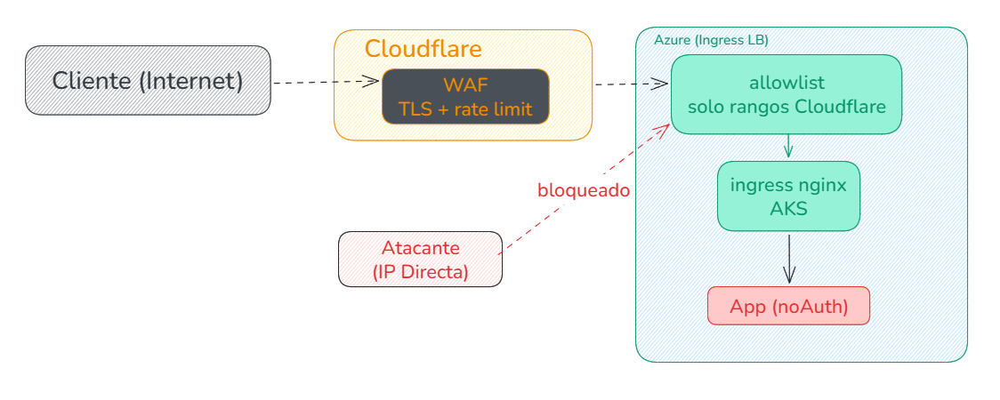
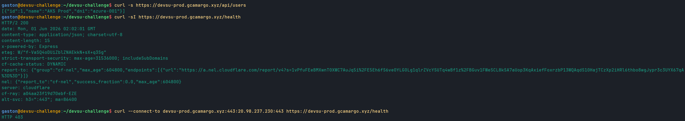
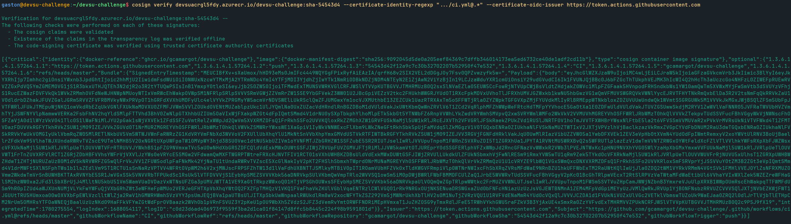
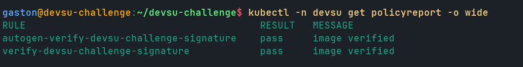
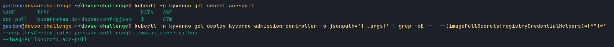

# Seguridad y hardening

El punto de partida condiciona todo lo que sigue, igual que en la arquitectura: Users API es un servicio HTTP publico, sin login y sin ninguna capa de identidad propia (los campos que maneja son dni y name, sobre `/api/users`). Cualquiera que conozca la URL le puede pegar. Como no hay autenticacion que filtre adentro, la postura es defensa en profundidad apoyada fuerte en el borde: que el origen no sea alcanzable directo, que todo el trafico pase por un punto donde aplicamos WAF, rate-limit y absorcion de DDoS, y que aun si algo se cuela el runtime de los pods y la red interna esten lo mas acotados posible. Cada capa asume que la anterior puede fallar y no confia en ella.

La forma mas comoda de recorrer la postura es seguir un request de afuera hacia adentro: TLS y filtrado en Cloudflare, llegada al ingress por una IP publica fija que solo deberia aceptar a Cloudflare, NetworkPolicy default-deny dentro del cluster, secretos que nunca tocan git, pipelines que se autentican sin secretos de larga vida, Kyverno verificando que nada se despliegue fuera de la linea de base y, al final del todo, el contenedor corriendo sin privilegios.

## TLS de punta a punta

Hay dos tramos en el camino del cliente al pod y cada uno tiene su propio certificado, asi que no existe un solo salto en claro.

El primer tramo, entre el cliente y Cloudflare, lo cubre Universal SSL: Cloudflare emite y renueva solo el certificado para `gcamargo.xyz` y `*.gcamargo.xyz`, sin que tengamos que tocar nada. El segundo tramo, entre Cloudflare y el ingress de AKS, va cifrado con un certificado Cloudflare Origin CA (wildcard, gratuito, valido unicamente para ese tramo Cloudflare-origen) instalado en el ingress como secret TLS. El modo SSL de la zona queda en Full (strict), que es la parte que cierra el circulo: en Full (a secas) Cloudflare cifra hacia el origen pero acepta cualquier certificado, incluso uno autofirmado o vencido, con lo cual un atacante en el medio del tramo Cloudflare-Azure podria hacerse pasar por el origen. Con Full strict, Cloudflare valida que el certificado del origen sea de confianza (el Origin CA lo es para Cloudflare), y si no lo es corta. El Ingress vive en [k8s/base/ingress.yaml](https://github.com/gcamargot/devsu-challenge/blob/master/k8s/base/ingress.yaml) y cada overlay le fija el host y el issuer que corresponde.

Hoy en el deploy del trial el origen usa el certificado de cert-manager segun el overlay (autofirmado en local, y la pieza de Let's Encrypt via DNS-01 contra Cloudflare queda lista en [k8s/overlays/aks](https://github.com/gcamargot/devsu-challenge/tree/master/k8s/overlays/aks) con el ClusterIssuer en [clusterissuer-letsencrypt.yaml](https://github.com/gcamargot/devsu-challenge/blob/master/k8s/overlays/aks/clusterissuer-letsencrypt.yaml)). El endurecimiento que cierra este punto es reemplazar ese cert por el Cloudflare Origin CA y pasar la zona a Full strict, y va de la mano con la restriccion de IPs de origen, que explicamos mas abajo y que ya quedo aplicada.

## El borde: WAF, rate-limit y DDoS

La idea original era resolver el borde con Azure Front Door y su WAF, lo natural estando todo en Azure, pero la suscripcion de prueba lo rechaza (`Free Trial and Student account is forbidden for Azure Frontdoor resources`). El requisito de fondo seguia en pie (un servicio publico sin auth necesita un borde que filtre y oculte el origen), asi que pasamos a Cloudflare, cuyo plan gratuito cubre justo eso. La pieza de Front Door quedo igual en el repo pero detras de un flag apagado ([frontdoor.tf](https://github.com/gcamargot/devsu-challenge/blob/master/terraform/frontdoor.tf)), de modo que en una cuenta sin la restriccion se puede volver a el prendiendolo.

En Cloudflare el borde nos da tres cosas que aprovechamos directamente. La proteccion DDoS volumetrica viene siempre activa en cualquier plan, sin configurar nada, y es lo que absorbe los picos antes de que toquen Azure. El WAF managed ruleset gratuito frena la familia conocida de ataques de aplicacion. Y arriba de eso sumamos una regla de rate-limit propia: en el plan free el rate-limit permite una sola regla con ventana de 10 segundos, asi que la armamos contando requests por `ip.src` combinado con `cf.colo.id` (el datacenter de Cloudflare que atiende, que ayuda a que el conteo sea por origen real y no se diluya entre PoPs). El security level de la zona quedo en medium. Toda la definicion de la zona y los records vive en Terraform, en [cloudflare.tf](https://github.com/gcamargot/devsu-challenge/blob/master/terraform/cloudflare.tf).

## Ocultar la IP de origen y restringir el trafico a Cloudflare

Aca esta el hardening central de esta pagina, y es el que mas nos importa por tratarse de un servicio sin auth. El borde de Cloudflare no sirve de nada si alguien puede saltearselo pegandole directo a la IP publica del ingress. Hoy el cliente solo ve las IPs anycast de Cloudflare (los dos records, el `A` de `devsu-prod` y el `A` wildcard `*.gcamargo.xyz`, estan en modo proxied, la "nube naranja"), nunca la del cluster, asi que la IP de origen no esta publicada en DNS. Pero "no publicada" no es lo mismo que "inalcanzable": la IP `20.98.237.230` existe y responde, y un escaneo de rangos de Azure o una filtracion historica de DNS la puede encontrar. Mientras ese camino directo siga abierto, todo el WAF, el rate-limit y el DDoS del borde son opcionales para el atacante.

El cierre es una allowlist a nivel del origen que solo deja entrar a Cloudflare, y hoy esta puesta y verificada en vivo. El mecanismo concreto que elegimos es la annotation `nginx.ingress.kubernetes.io/whitelist-source-range` en el Ingress, cargada con los rangos de IP publicados por Cloudflare (las listas oficiales `https://www.cloudflare.com/ips-v4` y `.../ips-v6`, ipv4 mas ipv6, en una sola linea sin espacios porque ingress-nginx parte por coma y no recorta blancos). Con eso ingress-nginx descarta a nivel de la capa 7 cualquier conexion cuyo origen no este en esos rangos, devolviendo 403, y la unica forma de llegar a la app pasa a ser atravesando el borde. El patch del Ingress vive en [k8s/overlays/aks-live/patch-ingress.yaml](https://github.com/gcamargot/devsu-challenge/blob/master/k8s/overlays/aks-live/patch-ingress.yaml). La misma idea se puede reforzar (o reemplazar) un escalon mas abajo con un NSG sobre la IP/subnet del Load Balancer del ingress, que filtra a nivel de red antes de que el paquete siquiera llegue a nginx; las dos no son excluyentes y el NSG tiene la ventaja de no depender de nada dentro del cluster.

Para que el filtro por IP de origen funcione, ingress-nginx tiene que ver la IP real del cliente (en este caso, la del nodo de Cloudflare), no la del Load Balancer de Azure que tiene adelante. Por eso el Service del ingress-controller corre con `externalTrafficPolicy: Local`, que preserva la IP de origen (a costa de que el balanceo solo llegue a nodos que tengan un pod del controller, algo que en este cluster no molesta). Si quedara con `externalTrafficPolicy: Cluster` (el default), el kube-proxy haria SNAT del trafico entre nodos y nginx terminaria viendo una IP interna del cluster, con lo cual la allowlist evaluaria siempre contra la IP equivocada. Como ese Service lo gestiona el Helm release de ingress-nginx (fuera del overlay), el cambio se aplico en vivo y quedo registrado en [svc-externaltrafficpolicy.md](https://github.com/gcamargot/devsu-challenge/blob/master/k8s/overlays/aks-live/svc-externaltrafficpolicy.md) (su lugar definitivo son los values del chart, `controller.service.externalTrafficPolicy: Local`); el bootstrap de addons que deja todo en su lugar vive en [scripts/bootstrap-addons.sh](https://github.com/gcamargot/devsu-challenge/blob/master/scripts/bootstrap-addons.sh). Como Cloudflare ya termina TLS y reescribe, tambien hay que confiar en los headers de Cloudflare para el real-ip del cliente final, pero para el proposito de la allowlist lo que importa es la IP de la capa TCP, que es la del PoP de Cloudflare.

> <font color="#cf222e">**Importante:**</font> la annotation y el `externalTrafficPolicy: Local` son una sola pieza y se revierten juntos o no se revierten. Si se vuelve el Service a `Cluster` (el default) dejando la allowlist puesta, nginx pasa a ver la IP del LB en vez del PoP de Cloudflare y el filtro bloquea a todo el mundo (la app queda inalcanzable, no abierta). El rollback correcto saca primero la annotation y despues toca el Service; el detalle esta en [svc-externaltrafficpolicy.md](https://github.com/gcamargot/devsu-challenge/blob/master/k8s/overlays/aks-live/svc-externaltrafficpolicy.md).

> <font color="#1a7f37">**Verificado:**</font> con la allowlist activa, pegarle directo a la IP de origen `20.98.237.230` devuelve 403 (nginx rechaza el origen fuera de rango), y por el dominio a traves de Cloudflare responde 200 con el header `cf-ray` presente. El camino directo al origen quedo efectivamente cerrado.

Mas alla del borde y la red, el servicio sin auth no es la unica superficie que conviene cuidar: el panel del provisioner self-service tambien suma sus propios controles. Esta detras de Cloudflare en `provisioner.gcamargo.xyz` (un CNAME proxied que enmascara el origen en Azure Container Apps) y, encima de eso, exige Basic Auth para todo lo que opera (usuario `devsu-admin`, password leida de los secrets de ACA y no horneada en la imagen); solo `/health` y `/ready` quedan abiertos para los probes. Y para que un mal uso, accidental o no, no pueda inflar la cuenta ni el cluster, hay un tope de tres entornos efimeros concurrentes: el cuarto pedido devuelve un 409 en vez de provisionar. El detalle de ese hardening (audit log persistente, TTL, estado por instancia) vive en la pagina del provisioner; el codigo del auth y el control de concurrencia esta en [src/auth.js](https://github.com/gcamargot/devsu-challenge/blob/master/provisioner/src/auth.js) y [src/server.js](https://github.com/gcamargot/devsu-challenge/blob/master/provisioner/src/server.js).




## Red interna: NetworkPolicy default-deny

Adentro del cluster la postura es default-deny con allow explicito, y es Azure CNI (`network_policy = azure`) lo que la vuelve efectiva. Esto nos costo un susto que vale contar porque ilustra la diferencia entre declarar y aplicar: en el cluster local con kind, que usa kindnet, las NetworkPolicies no se aplican y todo funcionaba igual aunque la default-deny estuviera puesta. Al pasar a AKS, con Azure CNI aplicandolas en serio, la app dejo de poder hablar con postgres hasta que agregamos la NetworkPolicy explicita que habilita ese tramo. Es exactamente el tipo de falla que solo aparece cuando la politica de verdad se enforcea.

El esquema queda asi. Kyverno genera por namespace una `default-deny-ingress` que arranca cerrando todo (ver la policy en [default-networkpolicy.yaml](https://github.com/gcamargot/devsu-challenge/blob/master/k8s/policies/default-networkpolicy.yaml)). Sobre esa base se abre lo minimo: una NetworkPolicy deja entrar al ingress-controller hacia los pods de la app en el puerto 8000 ([k8s/base/networkpolicy.yaml](https://github.com/gcamargot/devsu-challenge/blob/master/k8s/base/networkpolicy.yaml)), y otra deja que solo la app llegue a postgres en el 5432 (definida junto al postgres in-cluster en [k8s/overlays/local-kind/postgres.yaml](https://github.com/gcamargot/devsu-challenge/blob/master/k8s/overlays/local-kind/postgres.yaml)). Nada mas tiene acceso de ingress. El diseno productivo agrega ademas segmentacion a nivel de subnet con NSGs (VNet propia, base privada VNet-integrated) detras del flag `enable_vnet` en [network.tf](https://github.com/gcamargot/devsu-challenge/blob/master/terraform/network.tf), que cubre el este-oeste tambien a nivel de red y no solo de pod.

## Secretos: Key Vault y nada en git

El password de la base no esta en git ni en un Secret plano del repo (lo unico que hay versionado es un [secret.example.yaml](https://github.com/gcamargot/devsu-challenge/blob/master/k8s/base/secret.example.yaml) con placeholders). En AKS el valor lo guarda Azure Key Vault, definido en [keyvault.tf](https://github.com/gcamargot/devsu-challenge/blob/master/terraform/keyvault.tf) (con RBAC authorization, sin admin user), y lo lee el driver Secrets Store CSI en runtime, que lo sincroniza a un Secret de Kubernetes via el `SecretProviderClass` del overlay ([secretproviderclass.yaml](https://github.com/gcamargot/devsu-challenge/blob/master/k8s/overlays/aks/secretproviderclass.yaml)). El acceso al vault es por identidad administrada: la del CSI driver tiene el rol Key Vault Secrets User (solo lectura del secreto), separado de la identidad del deployer que tiene Secrets Officer para escribirlo. La app nunca conoce el password en texto en ningun manifiesto.

## OIDC sin secretos en CI/CD

El pipeline de CD no guarda ningun secreto de larga vida para hablar con Azure. La autenticacion es por OIDC: GitHub Actions presenta un token efimero que Azure valida contra una federated identity credential atada al repo y a la rama exacta (`repo:<owner>/<repo>:ref:refs/heads/master`), definida en [identity.tf](https://github.com/gcamargot/devsu-challenge/blob/master/terraform/identity.tf). El service principal de GitHub tiene solo los roles que necesita para desplegar (AcrPush sobre el registry y Cluster Admin sobre AKS), nada mas amplio. El workflow ([cd.yml](https://github.com/gcamargot/devsu-challenge/blob/master/.github/workflows/cd.yml)) pide `id-token: write` y hace el login con `azure/login@v2` sin un secret de cliente. Asi no hay una credencial robable colgada en GitHub que, si se filtra, de acceso permanente a la nube.

## Cadena de imagen: scan y superficie minima

En CI ([ci.yml](https://github.com/gcamargot/devsu-challenge/blob/master/.github/workflows/ci.yml)) la imagen pasa por Trivy con un gate que falla el build ante vulnerabilidades HIGH o CRITICAL que tengan fix (`--severity HIGH,CRITICAL --ignore-unfixed --exit-code 1`); ignoramos las sin fix para no romper por algo que no podemos corregir, pero no dejamos pasar lo que si se puede parchear. Ademas redujimos la superficie del runtime: el [Dockerfile](https://github.com/gcamargot/devsu-challenge/blob/master/Dockerfile) es multi-stage sobre `node:22-alpine`, borra el `package-lock.json` y desinstala npm/npx de la imagen final (no hacen falta en runtime y arrastraban CVEs de sus deps embebidas), con lo que llegamos a 0 HIGH/CRITICAL fixables. Tambien pasa por SonarQube Cloud para analisis estatico (un detalle real: Sonar miraba la rama "main" pero la principal es master, lo corregimos renombrando el main branch en SonarCloud).

## Firma de imagenes verificada en admision

La cadena de suministro no termina en el scan: ademas de que la imagen este limpia, queremos garantizar que la que corre en el cluster es exactamente la que produjo nuestro pipeline y nadie la sustituyo. Eso se cierra con firma criptografica y verificacion en el momento de admision. En CI la imagen se firma con cosign keyless (Fulcio emite un certificado efimero atado a la identidad OIDC del workflow y la firma queda en el log de transparencia Rekor; ver [ci.yml](https://github.com/gcamargot/devsu-challenge/blob/master/.github/workflows/ci.yml)), asi que no hay clave privada que custodiar ni rotar. En el CD, como `az acr import` copia solo la imagen y deja la firma atras, un `cosign copy` posterior lleva la firma y las attestations de GHCR a ACR, de modo que la imagen en el registry privado queda firmada igual que en GHCR (ver [cd.yml](https://github.com/gcamargot/devsu-challenge/blob/master/.github/workflows/cd.yml)).

Del lado del cluster, la policy Kyverno `verifyImages` ([k8s/policies/verify-images.yaml](https://github.com/gcamargot/devsu-challenge/blob/master/k8s/policies/verify-images.yaml)) valida esa firma en admision, acotada solo a las imagenes de `devsu-challenge` (las publicas como postgres, ingress-nginx, cert-manager o kyverno no se matchean nunca). Para leer la firma del ACR privado, Kyverno usa una credencial propia de pull: como el admin del registry esta deshabilitado y la identidad AcrPull del kubelet no la toma la ruta de verificacion de Kyverno, sin ella la policy fallaba con `UNAUTHORIZED: authentication required`. En esta version de Kyverno (v1.18) esa credencial es global, via el flag `--imagePullSecrets=acr-pull` en los controllers (un secret docker-registry `acr-pull` en el namespace `kyverno`, con un token de pull scope-mapeado del ACR); no existe un campo per-rule de imagePullSecrets, la CRD lo rechaza. El runbook de ese secret esta en [acr-pull-secret.md](https://github.com/gcamargot/devsu-challenge/blob/master/k8s/policies/acr-pull-secret.md).

Hoy la policy corre en modo Audit, pero ya no es un placebo: verifica de verdad la imagen real que corre y reporta PASS sobre ella (en los logs de Kyverno aparece "image attestors verification succeeded ... verifiedCount=1" y el policyreport del namespace `devsu` da `pass`). Mientras este en Audit, `verifyDigest` queda en `false`, porque las imagenes se despliegan por tag y en audit Kyverno no puede mutar a digest, asi que exigir digest daria "missing digest" aun con la firma valida. El paso de subir a Enforce (que rechaza en admision cualquier imagen propia sin firmar) va de la mano con `verifyDigest: true` y `mutateDigest: true`, y queda anotado en [Posibles mejoras](Posibles-mejoras.md).

## Runtime de los pods endurecido, verificado por Kyverno

La ultima capa es el contenedor en si, y no la dejamos librada a que cada manifiesto se acuerde de configurarla: Kyverno corre en modo Enforce y rechaza cualquier Pod que no cumpla la linea de base (las policies viven en [k8s/policies/](https://github.com/gcamargot/devsu-challenge/tree/master/k8s/policies)). Son tres. `require-requests-limits` obliga a que todo contenedor declare requests y limits de CPU y memoria ([require-requests-limits.yaml](https://github.com/gcamargot/devsu-challenge/blob/master/k8s/policies/require-requests-limits.yaml)), lo que evita el ruido de un pod sin techo comiendose el nodo. `restricted-securitycontext` exige correr non-root, sin privilege escalation, con rootfs de solo lectura y todas las capabilities dropeadas ([restricted-securitycontext.yaml](https://github.com/gcamargot/devsu-challenge/blob/master/k8s/policies/restricted-securitycontext.yaml)). Y `add-default-networkpolicy` es la que genera la default-deny por namespace que mencionamos arriba.

El Deployment de la app ([k8s/base/deployment.yaml](https://github.com/gcamargot/devsu-challenge/blob/master/k8s/base/deployment.yaml)) cumple esa linea de sobra: `runAsNonRoot` con uid 1000 (el usuario `node` que ya trae la imagen), `readOnlyRootFilesystem` con un emptyDir montado solo en `/tmp`, `allowPrivilegeEscalation: false`, `drop: [ALL]` de capabilities y `seccompProfile: RuntimeDefault`. El ServiceAccount va sin token automontado (no necesita hablar con la API de Kubernetes). La unica excepcion deliberada es el postgres in-cluster, que necesita un rootfs escribible para sus datos: esta excluido de la policy de securityContext por label, pero sigue obligado a declarar requests y limits. En produccion ese pod desaparece y lo reemplaza la base administrada, con lo que la excepcion tambien.

## Evidencia



Por el dominio la respuesta es 200 y trae el header `cf-ray`, que lo agrega Cloudflare y prueba que el request paso por el borde; pegandole directo a la IP de origen `20.98.237.230` la respuesta es 403. Significa que el origen solo se alcanza atravesando Cloudflare, con la allowlist de ingress-nginx activa y filtrando todo lo demas.



El `cosign verify` sale OK: valida los claims, encuentra la firma en el log de transparencia Rekor y verifica el certificado. Significa que la imagen esta firmada y es verificable de forma keyless, con la firma atada a la identidad del workflow de CI.



El policyreport de la policy verify-images da `pass` con el mensaje "image verified". Significa que Kyverno verifica la firma de la imagen en el momento de admision y la deja pasar (hoy corriendo en modo Audit).



Se ve el secret `acr-pull` en el namespace `kyverno` y el flag `--imagePullSecrets=acr-pull` cableado en el admission controller. Significa que Kyverno tiene su propia credencial para leer la imagen y su firma del ACR privado; sin ella la verificacion fallaba con `UNAUTHORIZED`.

Estas senales se reproducen con los siguientes comandos:

```bash
# 1) Directo a la IP de origen: con la allowlist activa debe ser rechazado (403) o quedar en timeout.
#    Forzamos el Host para descartar que falle solo por vhost.
curl -skI --resolve devsu-prod.gcamargo.xyz:443:20.98.237.230 https://devsu-prod.gcamargo.xyz/health --max-time 10
#    (o, mas simple, pegandole crudo a la IP)
curl -skI https://20.98.237.230/health --max-time 10

# 2) Via el dominio (a traves de Cloudflare): debe responder 200 y traer el header cf-ray.
curl -sI https://devsu-prod.gcamargo.xyz/health

# 3) NetworkPolicies efectivas en el namespace de la app.
kubectl get networkpolicy -n devsu

# 4) externalTrafficPolicy del Service del ingress-controller (debe ser Local para ver la IP real).
kubectl -n ingress-nginx get svc ingress-nginx-controller -o jsonpath='{.spec.externalTrafficPolicy}{"\n"}'

# 5) Kyverno en Enforce y el securityContext aplicado en los pods.
kubectl get cpol
kubectl -n devsu get deploy devsu-demo -o jsonpath='{.spec.template.spec.securityContext}{"\n"}{.spec.template.spec.containers[0].securityContext}{"\n"}'

# 6) Firma verificable de la imagen con cosign keyless.
cosign verify --certificate-identity-regexp '.*' --certificate-oidc-issuer https://token.actions.githubusercontent.com <imagen>
```
