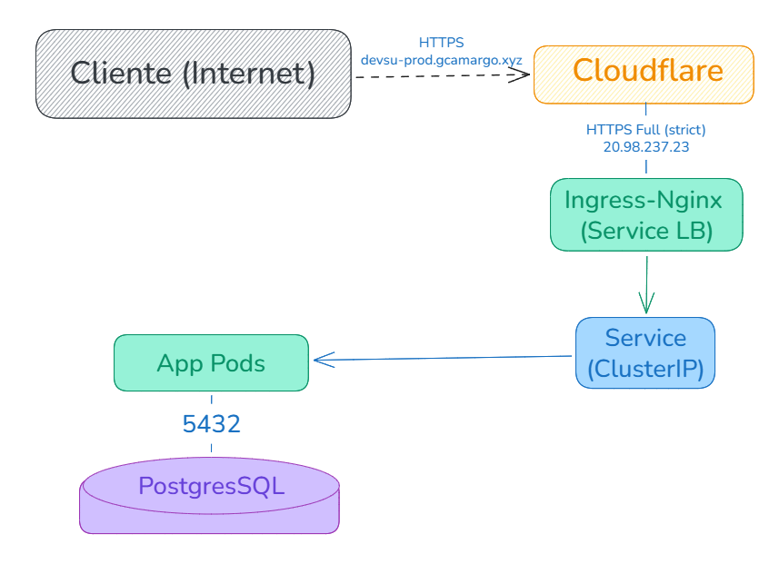

# Users API

Esta es la wiki del equipo para Users API, el servicio que documentamos y operamos en produccion. La armamos pensando en que cualquiera del equipo de plataforma pueda entender por que el sistema esta como esta, no solo que hace cada pieza. Si venis llegando, esta pagina es el punto de entrada: arranca con el contexto y al final hay un indice con el resto de las paginas.

> <font color="#0969da">**Nota:**</font> de un vistazo, el sistema es una API REST de usuarios sobre AKS, detras de Cloudflare, con CI/CD por GitHub Actions e infra como codigo en Terraform. Sobre esa base montamos dos cosas que conviene tener en el radar desde el principio: un provisioner self-service de entornos efimeros (publicado en https://provisioner.gcamargo.xyz, tambien detras de Cloudflare) y una capa de observabilidad off-cluster con Azure Managed Grafana y Prometheus administrado. Las dos tienen pagina propia mas abajo.

## Que es el servicio

Users API es un servicio REST de usuarios. El recurso es simple (cada usuario tiene un `dni` y un `name`) y la superficie HTTP cuelga de `/api/users` con las operaciones de listar, obtener y crear. Por debajo es Node con Express y Sequelize como ORM, y persiste en PostgreSQL. La logica de negocio no tiene mayor misterio; lo interesante (y lo que ocupa la mayor parte de esta wiki) es como lo empaquetamos, lo desplegamos y lo protegemos.

Hay un dato que conviene tener presente desde el principio porque ordena casi todas las decisiones que siguen: el servicio es publico y no tiene autenticacion. Cualquiera que conozca la URL le puede pegar, y no hay una capa de identidad que filtre quien entra. Eso nos obligo a apoyarnos fuerte en el borde para resolver lo que en un sistema con login se resolveria mas adentro: ocultar el origen, frenar abuso, absorber picos y ataques volumetricos. Por eso hay un proxy adelante, por eso el DNS quedo donde quedo y por eso el cluster no se expone directo. Cuando en las paginas de arquitectura y seguridad insistimos con el borde, viene de aca.

### Superficie HTTP

| Metodo | Ruta | Que hace |
|---|---|---|
| `GET` | `/api/users` | Lista todos los usuarios. |
| `GET` | `/api/users/:id` | Obtiene un usuario por id (responde `404` si no existe). |
| `POST` | `/api/users` | Crea un usuario a partir de `{ "dni", "name" }` (responde `400` si el `dni` ya existe). |
| `GET` | `/health` | Liveness. Responde mientras el proceso este vivo, sin tocar la base. |
| `GET` | `/ready` | Readiness. Responde `200` solo si la base contesta, `503` si no. |

La separacion entre `/health` y `/ready` no es cosmetica: si liveness consultara la base, una base intermitente reiniciaria los pods en cascada en vez de simplemente sacarlos de rotacion. Esa y otras mejoras sobre el starter las contamos en la pagina de la app y el contenedor.

## Arquitectura de alto nivel

Si uno sigue el camino de un request, el recorrido es lineal: entra por Cloudflare (que termina TLS y aplica WAF y rate-limit), Cloudflare reenvia al ingress de AKS por una IP publica fija, el ingress enruta al Service de la app, y la app resuelve contra PostgreSQL. Cada salto agrega algo y ninguno confia ciegamente en el anterior.




El detalle (certificados de cada tramo, NetworkPolicies, Key Vault, registry) esta en la pagina de [Arquitectura](Arquitectura-cloud.md). Una aclaracion que vale para todo lo que sigue: ese PostgreSQL hoy corre in-cluster, no como base administrada. Lo intentamos con Azure Database for PostgreSQL Flexible Server pero la suscripcion de prueba lo tiene restringido (`LocationIsOfferRestricted`), asi que el diseño managed quedo escrito en Terraform detras de un flag apagado y de momento usamos un postgres dentro del cluster. La app no se entera de la diferencia porque apunta a `DB_HOST`/`DB_PORT` por configuracion.

## Estado actual del despliegue

| Que | Donde |
|---|---|
| Region | `eastus2` (empezamos en `eastus` pero la prueba lo restringe) |
| Resource Group | `devsu-rg` |
| Cluster | AKS `devsu-aks`, 2x `Standard_D2s_v3`, control plane Free, Azure CNI |
| Registry | ACR `devsuacrgl5fdy` |
| Secretos | Key Vault `devsukvgl5fdy` (CSI driver) |
| Ingress | ingress-nginx con IP publica estatica `20.98.237.230` |
| Borde y DNS | Cloudflare (plan free), zona `gcamargo.xyz` |
| Host publico | `devsu-prod.gcamargo.xyz` |
| Provisioner self-service | Azure Container Apps detras de Cloudflare: https://provisioner.gcamargo.xyz (el origen `*.azurecontainerapps.io` queda enmascarado) |
| Observabilidad | Azure Managed Grafana `devsu-grafana` (https://devsu-grafana-hng2d6cze7fhh6ae.eus2.grafana.azure.com) + Azure Monitor managed Prometheus (workspace `devsu-amw`) |

Cada uno de esos valores tiene una historia detras, y casi todas son historias de pelearnos con las restricciones de la cuenta de prueba: el tamaño de nodo, la region, la base administrada, la cantidad de nodos, y hasta el borde (Azure Front Door esta prohibido en cuentas trial, por eso terminamos en Cloudflare). Lo contamos con detalle en las paginas de procedimiento y arquitectura, porque son justamente el tipo de decision que conviene dejar registrada para el que venga despues.

> <font color="#9a6700">**Atencion:**</font> esto corre sobre una suscripcion de prueba, asi que el costo importa. La pieza mas cara es la observabilidad: Azure Managed Grafana en plan Standard ronda los 65 USD/mes flat (mas el ingest de Prometheus, total ~70 USD/mes), por eso la apagamos cuando no la estamos usando. El detalle de costos por componente y el control con tags y budget esta en [Costos y FinOps](Costos-y-FinOps.md).

## Mapa de la wiki

Hay dos formas de leer esta documentacion. Si queres entender el sistema tal como esta hoy, documentado por componente, segui las primeras paginas. Si en cambio queres reconstruir el camino que recorrimos (util para reproducir el setup o entender por que algo es como es), las paginas de procedimiento van por etapas en el orden en que las fuimos resolviendo.

Vision del sistema:

- [Arquitectura](Arquitectura-cloud.md): los componentes de Azure, como se conectan y la postura de seguridad del conjunto.
- [Pipeline CI/CD](Pipeline-CICD.md): las etapas de build, test, scan y deploy, los triggers y el tagging de imagenes.
- [Operacion](Operacion.md): runbook del dia a dia (desplegar, ver estado y logs, HPA, rollback, costos).
- [Self-service provisioner](Self-service-provisioner.md): como pedir y destruir entornos efimeros (hoy en https://provisioner.gcamargo.xyz, con Basic Auth, audit log y tope de 3 entornos concurrentes).
- [Observabilidad](Observabilidad.md): la capa off-cluster de metricas, con Azure Managed Grafana, Prometheus administrado y el dashboard por namespace de los entornos efimeros.
- [Costos y FinOps](Costos-y-FinOps.md): como imputamos costos por proyecto y departamento con tags de Azure, el budget con alertas y que cuesta cada pieza.
- [Seguridad y hardening](Seguridad-y-hardening.md): el borde, las policies de Kyverno, el endurecimiento de los contenedores y lo que queda pendiente.
- [Posibles mejoras](Posibles-mejoras.md): el roadmap de mejoras de mayor valor todavia no aplicadas, en seguridad y FinOps.
- [Estructura del repositorio](Estructura-del-repositorio.md): que vive en cada carpeta del repo y por que esta organizado asi.

Procedimiento por etapas (el camino que recorrimos):

1. [App y contenedor](Procedimiento-1-app-y-contenedor.md)
2. [CI](Procedimiento-2-ci.md)
3. [Kubernetes local](Procedimiento-3-kubernetes-local.md)
4. [Infra en Azure](Procedimiento-4-infra-azure.md)
5. [Borde con Cloudflare](Procedimiento-5-edge-cloudflare.md)
6. [Provisioner](Procedimiento-6-provisioner.md)

## Evidencia

> Espacio para confirmar que el servicio responde como se describe (reemplazar por salida real o captura):
>
> - `curl -s https://devsu-prod.gcamargo.xyz/api/users` (lista de usuarios por HTTPS a traves de Cloudflare).
> - `curl -sI https://devsu-prod.gcamargo.xyz/health` (deberia traer el header `cf-ray` de Cloudflare).
> - `kubectl get pods,svc,ingress -n devsu`
>
> ```text
> (pegar aca la salida / captura)
> ```
